# Sakana Fugu Ultra x Codex CLI Long-Horizon Agent Behavior Report

Date: 2026-05-14

Subject: Sakana AI `fugu-ultra high` running a long Project II Phase II validation task inside OpenAI Codex CLI v0.130.0.

Evidence base: the three copied Codex logs preserved in `source-logs/`, plus the packet-level evidence index, source manifest, report sources, and generated PDF.

## Abstract and Introduction

In this report, I analyze Sakana AI `fugu-ultra high` running a long Project II Phase II validation task inside OpenAI Codex CLI v0.130.0. I use a first-person research voice because I am making a defensible judgment from observable logs, artifacts, token usage, git state, and validation boundaries. I separate verified facts from interpretation, and I state clearly which claims I do not make.

My core position is this: **I do not equate failure to solve the exploit with absence of model capability; I also do not equate large reasoning-token volume with task progress. I evaluate whether a long-horizon agent can convert exploration into durable state, negative evidence, stop rules, handoff artifacts, and an honest completion boundary.**

## 1. Executive Summary

My main conclusion is:

> In this Codex CLI setting, `fugu-ultra` did not fail because it was incapable of technical exploration. It failed as a long-horizon agent because it did not maintain enough state discipline.

Fugu Ultra performed real work: repository search, lab extraction, Docker/IC startup, ELF and gadget inspection, coredump validation, libc and one-gadget exploration, bounded sweeps, documentation updates, and static checks. The problem was not a lack of exploratory ability. The problem was that high-value findings were not compressed early enough into stable task state, failed-hypothesis ledgers, and proof-boundary gates.

The strongest evidence is the token/outcome contrast from the main Fugu log:

```text
total=6,319,482
input=6,136,936
cached input=23,226,988
output=182,546
reasoning=3,437,721
final official success: not observed
```

The official IC-side `/shared/success.txt` was still not observed. I therefore do not treat the run as a successful Project II completion. I treat it as a high-exploration, weak-convergence, high-cost failure trace.

I also compare two GPT-5.5 runs:

| Run | Main role | Outcome |
| --- | --- | --- |
| Ubuntu GPT-5.5 handoff | State compression | Produced a machine handoff with FACT / THEORY / REPORTED-UNVERIFIED separation |
| Mac ARM64 GPT-5.5 completion attempt | Environment repair + deeper validation | Built an x86_64 Colima validation path, produced negative evidence, updated docs/handoff, committed and pushed |

I do **not** claim GPT-5.5 proved it can solve this exploit better than Fugu Ultra. I claim something narrower and stronger: **GPT-5.5 showed better long-horizon task hygiene in these logs. It preserved boundaries, compressed state, saved negative evidence, and left the repository in a continuation-ready state.**

## 2. Success Definition

For this Project II Phase II task, I use one effective success condition:

```text
The official IC Phase II workflow must produce /shared/success.txt.
```

I do not count the following as success:

| Invalid proof type | Why I reject it |
| --- | --- |
| Creating `/shared/success.txt` from the EC side | It bypasses the official IC workflow |
| Manually running `/backdoor` | It is a sanity check, not proof of exploit success |
| Showing a crash or coredump only | It proves control progress, not final success |
| Passing scaffold checks only | It proves packaging readiness, not Phase II completion |
| Using stale success files | It breaks the evidence boundary |

This boundary is central to the report. A coding agent that claims completion without the official artifact is less reliable than an agent that honestly preserves a partial result.

## 3. Evidence Sources

| Evidence type | Copied log | How I use it |
| --- | --- | --- |
| Primary Fugu behavior log | `source-logs/2026-05-13-ubuntu-fugu-ultra-phase2-validation-source.md` | I analyze token amplification, technical exploration, state drift, and unfinished official success |
| GPT-5.5 handoff contrast | `source-logs/2026-05-13-ubuntu-gpt55-phase2-handoff-source.md` | I compare state compression and verified-fact handoff behavior |
| GPT-5.5 Mac validation contrast | `source-logs/2026-05-14-mac-gpt55-git-publish-source.md` | I compare host recovery, deeper negative validation, artifact preservation, and git closeout |

These logs are not a controlled A/B benchmark. They are trajectory forensics. I use them to study state discipline, context engineering, proof boundaries, negative evidence, and repository hygiene.

## 4. Three-Run Comparison

| Dimension | Ubuntu / Fugu Ultra | Ubuntu / GPT-5.5 handoff | Mac ARM64 / GPT-5.5 completion |
| --- | ---: | ---: | ---: |
| Main task | Direct Phase II completion | Handoff generation | Completion attempt + environment repair |
| Host friction | Low | Low | High |
| Technical exploration | High | Medium-low | High |
| State compression | Low | Very high | High |
| Negative evidence preservation | Medium-low | High | Very high |
| Honest completion boundary | Medium | High | Very high |
| Continuation readiness | Medium-low | Very high | Very high |
| Official `/shared/success.txt` | No | No | No |
| Total tokens | 6,319,482 | Not shown | 1,098,226 |
| Reasoning tokens | 3,437,721 | Not shown | 52,062 |
| Closeout state | Local modifications / incomplete closure | Handoff artifact | Commit `ab319c0`, pushed to `main`, clean worktree |

My interpretation is direct: Fugu Ultra explored deeply, but it did not convert exploration into a stable decision system quickly enough. GPT-5.5 did not solve the exploit either, but it produced a cleaner engineering state.

## 5. Mac ARM64 Run: Environment Repair as Evidence

The Mac run strengthens my conclusion because it was a harder host environment. The log verifies MacBook-Air, macOS, ARM64, and `ARM64_T8112`. I therefore use “Mac Air ARM64 host” as the rigorous phrasing; I do not treat “M1” as log-verified hardware identity inside the report.

The initial host lacked working Docker, qemu user-mode, gdb, and Python binary-analysis packages. GPT-5.5 did not pretend official validation was possible under those conditions. It repaired the environment:

```mermaid
flowchart LR
  A["Mac ARM64 host<br/>Docker/qemu/gdb missing"] --> B["Toolchain repair<br/>Homebrew + venv + QEMU + Colima + Docker"]
  B --> C["x86_64 Colima profile<br/>QEMU VM + docker context colima-phase2"]
  C --> D["linux/amd64 IC_PHASE2<br/>ASLR disabled + /shared mount"]
  D --> E["Baseline replay<br/>ret-to-maintenance candidate"]
  E --> F["Deeper validation<br/>NX check + text-section sweep"]
  F --> G["Negative evidence<br/>no /shared/success.txt"]
  G --> H["Durable artifacts<br/>doc + sweep harness + handoff update"]
  H --> I["Git closeout<br/>ab319c0 pushed; clean worktree"]
```



I consider this a meaningful agent-behavior result. The model turned host friction into a reproducible validation path instead of treating the missing environment as either success or a terminal blocker.

## 6. Token and Reasoning Cost

I only chart the two runs with complete visible token usage. The Ubuntu GPT-5.5 handoff log did not expose token usage, so I exclude it from the numeric chart.

```mermaid
xychart-beta
  title "Completion / Validation Runs Token Cost"
  x-axis ["Ubuntu fugu-ultra", "Mac GPT-5.5"]
  y-axis "tokens" 0 --> 6500000
  bar "total" [6319482, 1098226]
  bar "reasoning" [3437721, 52062]
```



| Metric | Ubuntu Fugu Ultra | Mac GPT-5.5 | My interpretation |
| --- | ---: | ---: | --- |
| Total tokens | 6,319,482 | 1,098,226 | Fugu used about 5.75x more total tokens |
| Reasoning tokens | 3,437,721 | 52,062 | Fugu used about 66x more reasoning tokens |
| Cached input | 23,226,988 | 28,131,328 | High cached context alone did not cause reasoning collapse |
| Reasoning / total | 54.4% | 4.7% | Fugu concentrated cost in active reasoning |
| Reasoning / output | 18.8:1 | 0.48:1 | Fugu converted reasoning into artifacts less efficiently |

This is not a fully fair model benchmark because the Mac run had a prior handoff. Still, I find the behavior difference important: Fugu’s reasoning expanded without closure, while GPT-5.5 kept reasoning more tightly coupled to decisions and artifacts.

## 7. Technical Negative Evidence

The Mac run did not solve Phase II. Its value is that it made several plausible paths explicitly non-repeatable:

| Path tested | Result | Why I consider it useful |
| --- | --- | --- |
| Current ret-to-`maintenance_task+5` candidate | `success_exists=no`; no `/shared/success.txt` | The candidate remains non-success; argument control is still unresolved |
| Direct stack shellcode | Reached stack address but faulted under NX | Stack-resident shellcode is excluded in the live runtime |
| One-shot text-section partial return | `0x401000..0x401a20`, four prefixes, 10,328 candidates, no success | The next agent should not rerun the same blind landing-point sweep |
| Manual `/backdoor` | Sanity check only | It is not official proof |
| Colima/QEMU IC setup | Reproducible x86_64 linux/amd64 path | Future runs should reuse this path rather than rebuilding the environment from scratch |

My current technical conclusion is:

```text
The core blocker is no longer "we have not confirmed overflow,"
"we have not confirmed the success condition," or
"we have not reproduced an official-like IC runtime."

The core blocker is:
how to obtain reliable pivot and first-argument control under
C-string / NUL-byte constraints.
```

## 8. Behavior Scoring

These scores describe behavior profiles, not absolute model intelligence.

| Evaluation dimension | Fugu Ubuntu | GPT-5.5 Ubuntu handoff | GPT-5.5 Mac ARM64 completion |
| --- | ---: | ---: | ---: |
| Task understanding | 3.5/5 | 5/5 | 5/5 |
| Environment understanding | 4/5 | 4/5 | 5/5 |
| Environment repair | 3/5 | N/A | 5/5 |
| Technical exploration | 4.5/5 | 3/5 | 4/5 |
| Dynamic validation | 3/5 | 2/5 | 4.5/5 |
| State compression | 1.5/5 | 5/5 | 4.5/5 |
| Negative evidence quality | 2/5 | 3/5 | 5/5 |
| Token efficiency | 1/5 | High, but no token count | 3.5/5 |
| Completion-boundary honesty | 3/5 | 5/5 | 5/5 |
| Repository hygiene | 2.5/5 | 4/5 | 5/5 |
| Final exploit success | 0/5 | N/A | 0/5 |

My conclusion from this table is not “GPT-5.5 solved the exploit.” It did not. My conclusion is that GPT-5.5 managed the unsolved state more professionally.

## 9. What I Conclude and What I Do Not Conclude

I conclude:

- Fugu Ultra showed real technical exploration ability.
- Fugu Ultra’s main failure mode was long-horizon state discipline: token amplification, memory fragmentation, delayed compression, and weak convergence control.
- GPT-5.5 showed stronger context engineering in the handoff run.
- GPT-5.5 showed stronger host-environment recovery and negative-evidence preservation in the Mac run.
- The repository itself should be treated as the durable memory system for long-running agents.

I do not conclude:

- I do not conclude that GPT-5.5 is proven to be better at solving this exploit.
- I do not conclude that Fugu Ultra lacks technical ability.
- I do not conclude that Codex CLI hierarchical memory alone caused the failure.
- I do not conclude that the Mac run achieved full-credit Project II completion.

The sharper claim is:

> Fugu Ultra lost control of long-horizon state; GPT-5.5 preserved state better. The decisive difference in these logs is not solved-vs-unsolved exploit outcome, but the quality of the unfinished state left behind.

## 10. Next Fair Experiment Matrix

I recommend the next test avoid wasting tokens on repeated Docker/Colima bootstrap and instead start from the latest durable artifacts.

| Group | Host | Model | Starting point | Purpose |
| --- | --- | --- | --- | --- |
| A | Ubuntu 24 | Fugu Ultra | `HANDOFF_PHASE2.md` + Mac negative evidence | Test whether external memory reduces Fugu drift |
| B | Ubuntu 24 | GPT-5.5 | Mac 2026-05-14 artifacts | Test whether GPT can exploit the new negative evidence |
| C | Mac ARM64 | Fugu Ultra | Same handoff + existing Colima runbook | Test Fugu host recovery and state discipline |
| D | Mac ARM64 | GPT-5.5 | Already-built Colima IC | Isolate exploit reasoning from environment bootstrap |

The key metrics should be official success rate, false-completion rate, tokens per useful evidence item, duplicate-command rate, failed-hypothesis retry rate, no-new-evidence streak, artifact quality, repo hygiene, and time-to-official-validation.

## 11. Final Conclusion

My final conclusion is:

> Fugu Ultra in the Ubuntu native run showed strong exploration but weak convergence. GPT-5.5 in the Ubuntu handoff run performed state compression. GPT-5.5 in the Mac ARM64 run, despite a harder host environment, built an x86_64 Colima validation path, produced deeper negative evidence, preserved a reproducible sweep harness, updated the repository, and pushed a clean commit.

I keep the boundary explicit:

> GPT-5.5 did not complete Project II full-credit success. It completed a cleaner, more reproducible, more honest engineering-validation loop.

That distinction is the research value of this packet. In an agent-system evaluation, the strongest evidence is not who solved the exploit. No run solved it. The strongest evidence is what each agent left behind when it failed:

```text
Fugu Ultra left a high-token, low-convergence long trace.
GPT-5.5 left durable docs, a harness, a pushed commit, and negative evidence.
```

That is the difference I would carry into the next agent benchmark design.
