# ISO 27001 是什麼？

ISO/IEC 27001 是一套「資訊安全管理標準」。

你可以把它想像成：

> 一家公司如何有系統地保護自己的資料、系統、帳號、客戶資訊、內部文件、AI 模型、伺服器與營運流程的一套國際規則。

它不是防毒軟體，也不是單一資安工具。它更像是「整家公司怎麼管理資訊安全」的作業制度。

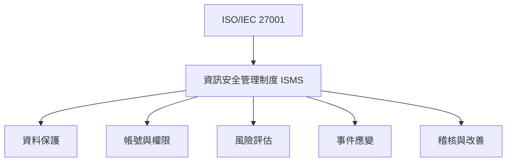
```mermaid
flowchart TD
    A[ISO/IEC 27001] --> B[資訊安全管理制度 ISMS]
    B --> C[資料保護]
    B --> D[帳號與權限]
    B --> E[風險評估]
    B --> F[事件應變]
    B --> G[稽核與改善]
```

## 用高中生能懂的方式理解

可以把 ISO/IEC 27001 想成「學校的資安校規」。

如果學校完全沒規定，可能會變成：

- 誰都能進電腦教室。
- 成績檔案沒有密碼。
- 老師帳號共用。
- USB 隨便插。
- 學生個資亂傳。

所以學校會制定門禁、帳號權限、備份制度、緊急處理流程，以及誰能看哪些資料。ISO/IEC 27001 做的是同一件事，只是對象從學校變成公司、醫院、政府、AI 公司、金融機構、雲端平台、工廠或 SaaS 公司。

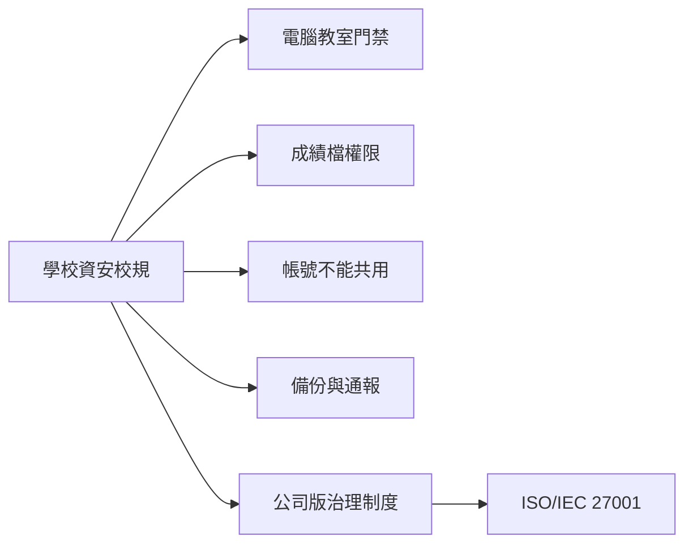
```mermaid
flowchart LR
    A[學校資安校規] --> B[電腦教室門禁]
    A --> C[成績檔權限]
    A --> D[帳號不能共用]
    A --> E[備份與通報]
    A --> F[公司版治理制度]
    F --> G[ISO/IEC 27001]
```

# 核心概念

ISO/IEC 27001 的核心可以用一句話說：

> 持續降低資訊安全風險。

它不是追求「永遠不被駭」。真正重要的是：

- 有沒有制度。
- 有沒有風險管理。
- 有沒有紀錄。
- 有沒有改善流程。
- 出事後能不能快速復原。

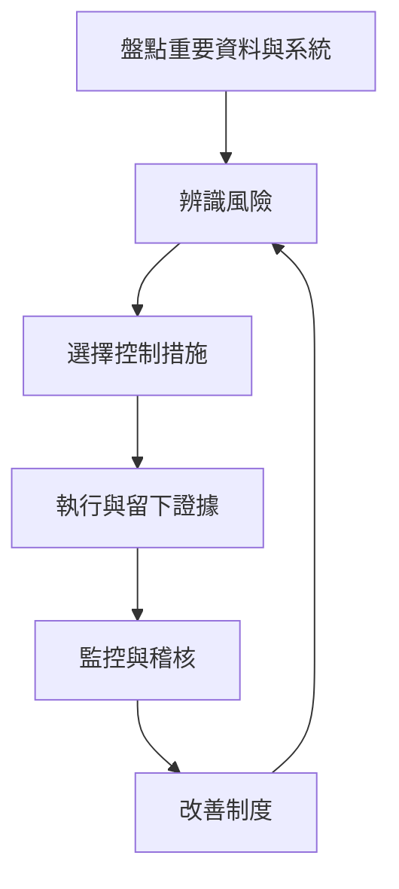
```mermaid
flowchart TD
    A[盤點重要資料與系統] --> B[辨識風險]
    B --> C[選擇控制措施]
    C --> D[執行與留下證據]
    D --> E[監控與稽核]
    E --> F[改善制度]
    F --> B
```

# 正式定義

ISO/IEC 27001 的正式名稱是：

> ISO/IEC 27001 Information Security Management Systems, ISMS

中文通常翻成：

> 資訊安全管理系統

重點是 ISMS。ISMS 不是單一工具，而是一整套管理制度、技術措施、風險評估、人員訓練、文件流程與稽核制度。

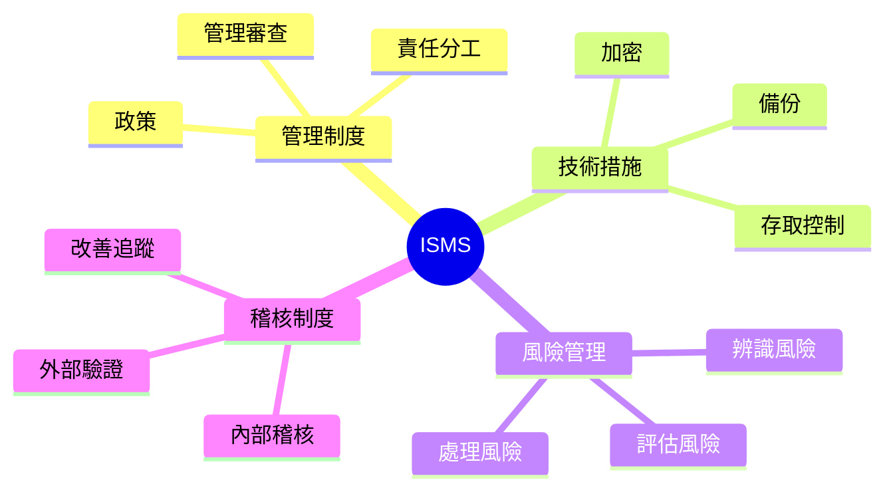
```mermaid
mindmap
  root((ISMS))
    管理制度
      政策
      責任分工
      管理審查
    技術措施
      加密
      備份
      存取控制
    風險管理
      辨識風險
      評估風險
      處理風險
    稽核制度
      內部稽核
      外部驗證
      改善追蹤
```

# 範圍是什麼？

很多人以為 ISO/IEC 27001 只有 IT 部門要管，其實它可能涵蓋整個組織。

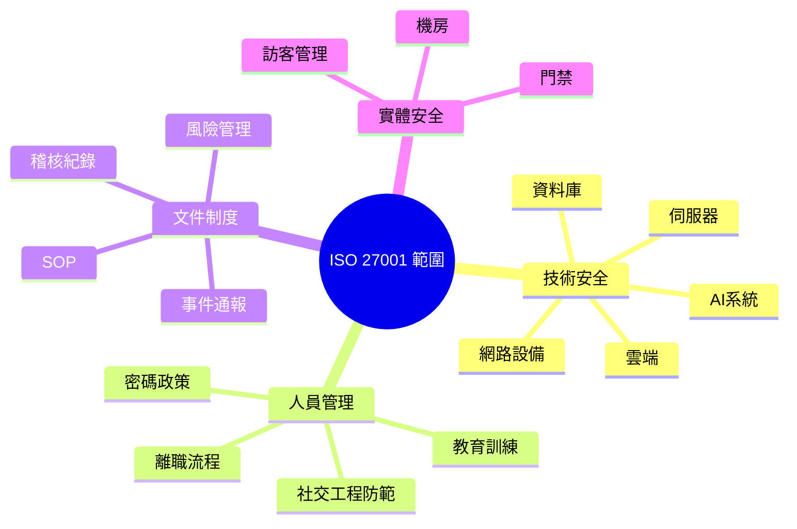
```mermaid
mindmap
  root((ISO 27001 範圍))
    技術安全
      伺服器
      雲端
      AI系統
      網路設備
      資料庫
    人員管理
      密碼政策
      教育訓練
      離職流程
      社交工程防範
    文件制度
      SOP
      稽核紀錄
      風險管理
      事件通報
    實體安全
      門禁
      機房
      訪客管理
```

# 影響的範圍有哪些？

ISO/IEC 27001 影響的不只是工程師。它可能影響業務、人資、法務、採購、行政、主管與外包廠商。

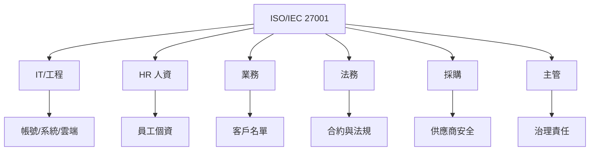
```mermaid
flowchart TD
    A[ISO/IEC 27001] --> B[IT/工程]
    A --> C[HR 人資]
    A --> D[業務]
    A --> E[法務]
    A --> F[採購]
    A --> G[主管]
    B --> H[帳號/系統/雲端]
    C --> I[員工個資]
    D --> J[客戶名單]
    E --> K[合約與法規]
    F --> L[供應商安全]
    G --> M[治理責任]
```

# 誰需要遵守？

法律上不一定每家公司都強制要做 ISO/IEC 27001，但很多時候是客戶、政府案、金融機構、醫院或國際合作夥伴會要求。

常見需要的組織：

| 組織 | 原因 |
|---|---|
| 銀行 | 金融資料、交易紀錄、帳戶資訊 |
| 醫院 | 病歷、醫療影像、個資 |
| AI 公司 | 使用者資料、模型、API keys、雲端環境 |
| SaaS 公司 | 客戶資料放在平台上 |
| 雲端服務商 | 管理大量企業資料 |
| 政府承包商 | 可能處理公部門資料 |
| 半導體公司 | 研發機密與供應鏈資料 |

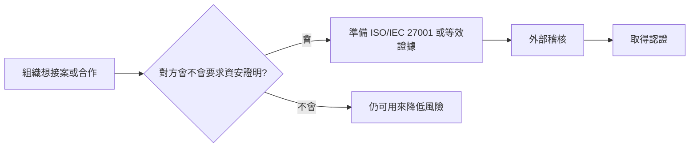
```mermaid
flowchart LR
    A[組織想接案或合作] --> B{對方會不會要求資安證明?}
    B -->|會| C[準備 ISO/IEC 27001 或等效證據]
    B -->|不會| D[仍可用來降低風險]
    C --> E[外部稽核]
    E --> F[取得認證]
```

# 怎麼取得認證？

公司通常需要建立制度、做風險管理、建立控制措施、做內部稽核，再接受外部驗證機構稽核。

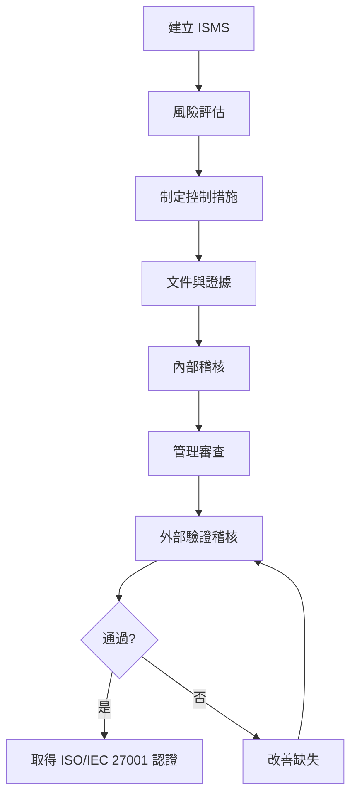
```mermaid
flowchart TD
    A[建立 ISMS] --> B[風險評估]
    B --> C[制定控制措施]
    C --> D[文件與證據]
    D --> E[內部稽核]
    E --> F[管理審查]
    F --> G[外部驗證稽核]
    G --> H{通過?}
    H -->|是| I[取得 ISO/IEC 27001 認證]
    H -->|否| J[改善缺失]
    J --> G
```

# 什麼時候更新？最新版本是什麼？

截至 2026-05-08 查證：

- 最新主版本是 ISO/IEC 27001:2022。
- ISO 官方頁面列出 ISO/IEC 27001:2022 是第 3 版，發布於 2022 年 10 月。
- ISO 官方頁面也列出 ISO/IEC 27001:2022/Amd 1:2024，這是 2024 年的 Amendment 1，主題是 climate action changes。
- 舊的 ISO/IEC 27001:2013 轉換到 2022 版的期限已在 2025-10-31 結束。

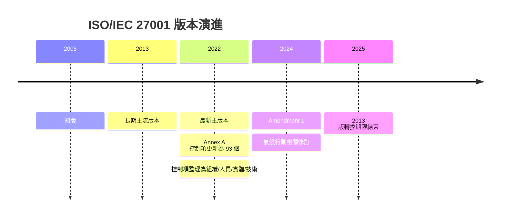
```mermaid
timeline
    title ISO/IEC 27001 版本演進
    2005 : 初版
    2013 : 長期主流版本
    2022 : 最新主版本
         : Annex A 控制項更新為 93 個
         : 控制項整理為組織/人員/實體/技術
    2024 : Amendment 1
         : 氣候行動相關修訂
    2025 : 2013 版轉換期限結束
```

# 重要控制項

2022 版 Annex A 有 93 個控制項，整理成四大主題：

- Organizational 組織。
- People 人員。
- Physical 實體。
- Technological 技術。

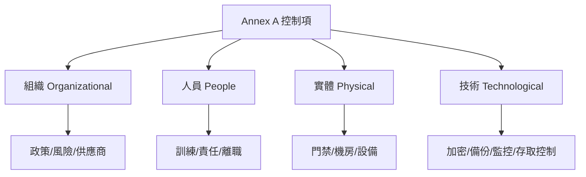
```mermaid
flowchart TD
    A[Annex A 控制項] --> B[組織 Organizational]
    A --> C[人員 People]
    A --> D[實體 Physical]
    A --> E[技術 Technological]
    B --> B1[政策/風險/供應商]
    C --> C1[訓練/責任/離職]
    D --> D1[門禁/機房/設備]
    E --> E1[加密/備份/監控/存取控制]
```

# 現實世界例子一：醫院

醫院有病歷、健檢報告、醫療影像、身分證字號、保險資料與醫師診斷紀錄。

如果沒有制度，可能發生病歷外流、醫生帳號共用、醫療影像沒加密、勒索病毒讓醫院停擺、離職人員帳號還能登入。

ISO/IEC 27001 可以協助醫院建立病歷權限控管、備份制度、帳號管理、事件回報流程與勒索病毒應變。

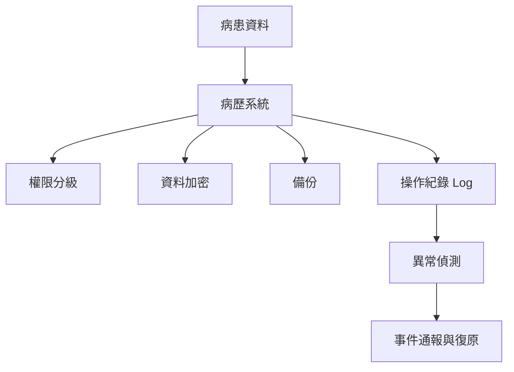
```mermaid
flowchart TD
    A[病患資料] --> B[病歷系統]
    B --> C[權限分級]
    B --> D[資料加密]
    B --> E[備份]
    B --> F[操作紀錄 Log]
    F --> G[異常偵測]
    G --> H[事件通報與復原]
```

# 現實世界例子二：AI SaaS 公司

AI SaaS 公司可能處理使用者聊天紀錄、客戶文件、API keys、模型設定、prompt templates、雲端資料庫與後台管理帳號。

如果沒有制度，可能發生 API key 外洩、對話紀錄外流、雲端 bucket 公開、測試資料沒有去識別化、離職員工仍可登入後台。

ISO/IEC 27001 可以要求權限分級、log 紀錄、金鑰管理、雲端安全設定、員工教育與事件應變。

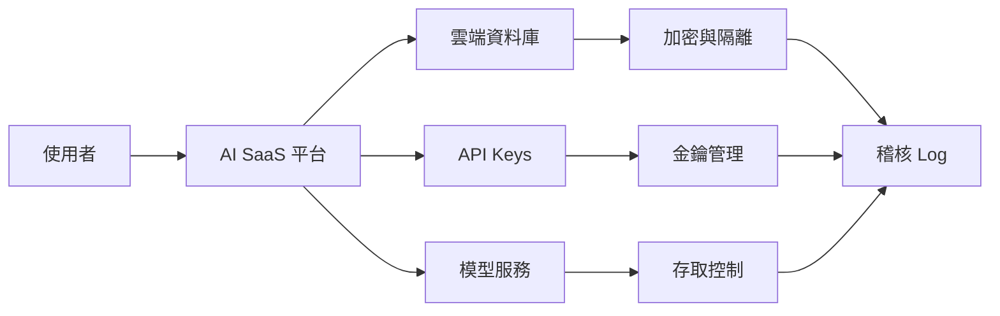
```mermaid
flowchart LR
    A[使用者] --> B[AI SaaS 平台]
    B --> C[模型服務]
    B --> D[雲端資料庫]
    B --> E[API Keys]
    D --> F[加密與隔離]
    E --> G[金鑰管理]
    C --> H[存取控制]
    F --> I[稽核 Log]
    G --> I
    H --> I
```

# 現實世界例子三：半導體公司

半導體公司最怕晶片設計資料外流、製程參數被偷、供應鏈資料外洩、研發文件被複製。

ISO/IEC 27001 可能包含 USB 管制、機房門禁、檔案加密、權限隔離、設備監控、供應商安全審查與異常下載偵測。

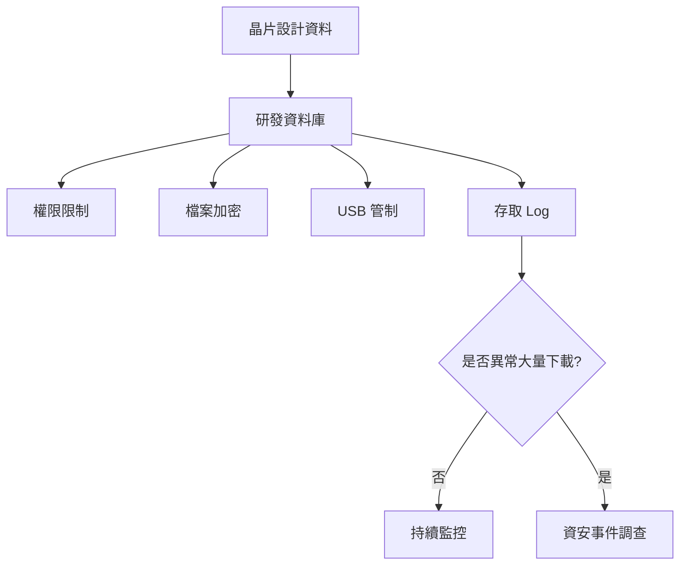
```mermaid
flowchart TD
    A[晶片設計資料] --> B[研發資料庫]
    B --> C[權限限制]
    B --> D[檔案加密]
    B --> E[USB 管制]
    B --> F[存取 Log]
    F --> G{是否異常大量下載?}
    G -->|否| H[持續監控]
    G -->|是| I[資安事件調查]
```

# 常見誤解

誤解一：「有 ISO/IEC 27001 就不會被駭。」

正解：它不是無敵護盾，而是降低風險與提升管理能力。

誤解二：「只有 IT 要管。」

正解：HR、法務、管理層、行政、採購、外包廠商都可能被納入。

誤解三：「買防毒軟體就等於 ISO/IEC 27001。」

正解：防毒只是工具，ISO/IEC 27001 是管理系統。

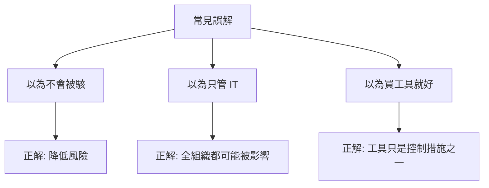
```mermaid
flowchart TD
    A[常見誤解] --> B[以為不會被駭]
    A --> C[以為只管 IT]
    A --> D[以為買工具就好]
    B --> E[正解: 降低風險]
    C --> F[正解: 全組織都可能被影響]
    D --> G[正解: 工具只是控制措施之一]
```

# 延伸產品案例：Lenovo LDO 類雲端裝置管理平台

如果把 ISO/IEC 27001 放到 Lenovo Device Orchestration, LDO 這類產品，核心問題會變成：

> 這個雲端裝置管理平台，如何有制度地保護企業裝置資料、管理權限、遠端操作能力、更新流程、Log、雲端平台與支援人員的安全？

Lenovo LDO 官方支援頁把 LDO 描述為 intelligent endpoint management solution，讓 IT 團隊監控、管理並保護裝置。Requirements 頁也說 LDO 是 cloud-based solution，透過 lightweight agents 收集資料，讓客戶不用自己建置基礎設施就能取得結果。

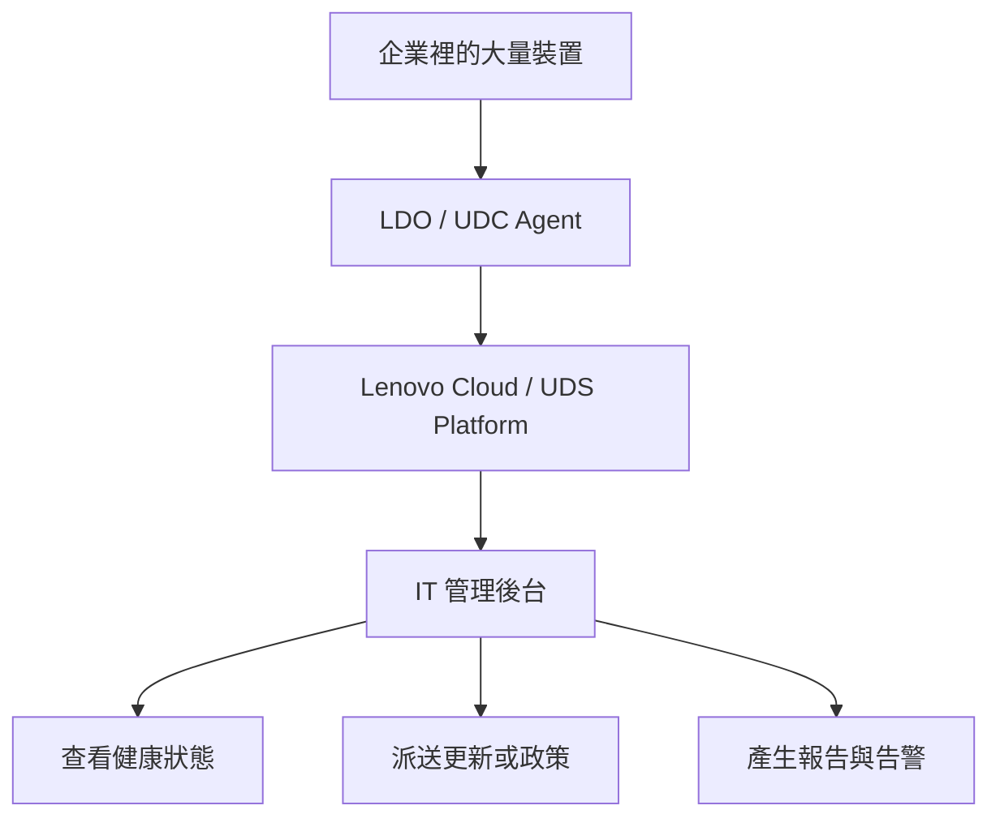
```mermaid
flowchart TD
    A[企業裡的大量裝置] --> B[LDO / UDC Agent]
    B --> C[Lenovo Cloud / UDS Platform]
    C --> D[IT 管理後台]
    D --> E[查看健康狀態]
    D --> F[派送更新或政策]
    D --> G[產生報告與告警]
```

## LDO 可以怎麼用高中生版本理解？

你可以把 LDO 想成：

> 全校電腦健康管理系統。

假設一間學校有 3,000 台筆電、平板和電腦教室主機。IT 老師不可能一台一台檢查，所以需要集中看到：

- 哪些電腦太久沒更新。
- 哪些裝置電池健康度差。
- 哪些裝置可能有安全問題。
- 哪些機器需要更新 BIOS、driver、firmware。
- 哪些裝置有異常狀態。
- 哪些裝置需要遠端支援。

放到企業，就是員工筆電、工廠 edge device、Android tablet、Ubuntu endpoint、Windows notebook，甚至 ChromeOS、AR/VR、macOS、iOS 等不同情境。

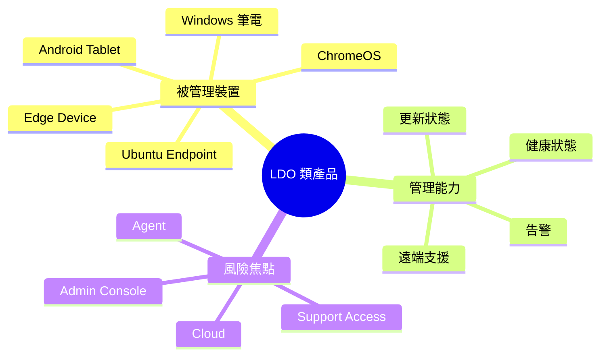
```mermaid
mindmap
  root((LDO 類產品))
    被管理裝置
      Windows 筆電
      Ubuntu Endpoint
      Android Tablet
      Edge Device
      ChromeOS
    管理能力
      健康狀態
      更新狀態
      告警
      遠端支援
    風險焦點
      Agent
      Cloud
      Admin Console
      Support Access
```

## 為什麼 LDO 類產品讓 ISO 27001 變重要？

因為它很有權力。

它可以看裝置狀態，可能能推送更新，可能連到企業內部大量 endpoint。管理後台如果被盜，影響可能不是一台電腦，而是一整批裝置。

這叫做 management plane risk。

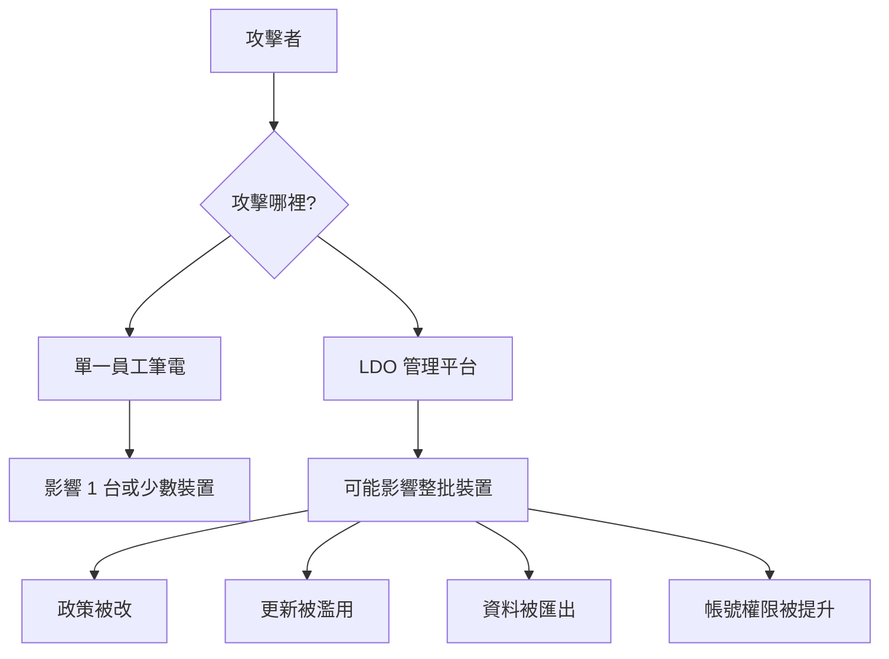
```mermaid
flowchart TD
    A[攻擊者] --> B{攻擊哪裡?}
    B --> C[單一員工筆電]
    B --> D[LDO 管理平台]
    C --> E[影響 1 台或少數裝置]
    D --> F[可能影響整批裝置]
    F --> G[政策被改]
    F --> H[更新被濫用]
    F --> I[資料被匯出]
    F --> J[帳號權限被提升]
```

所以 ISO/IEC 27001 在 LDO 類產品裡，不是只問「這台筆電有沒有比較安全」，而是問：

> Lenovo 或供應商是否用可稽核、可追蹤、可持續改善的 ISMS，管理 LDO 服務背後的人、流程、系統、雲端、資料與風險？

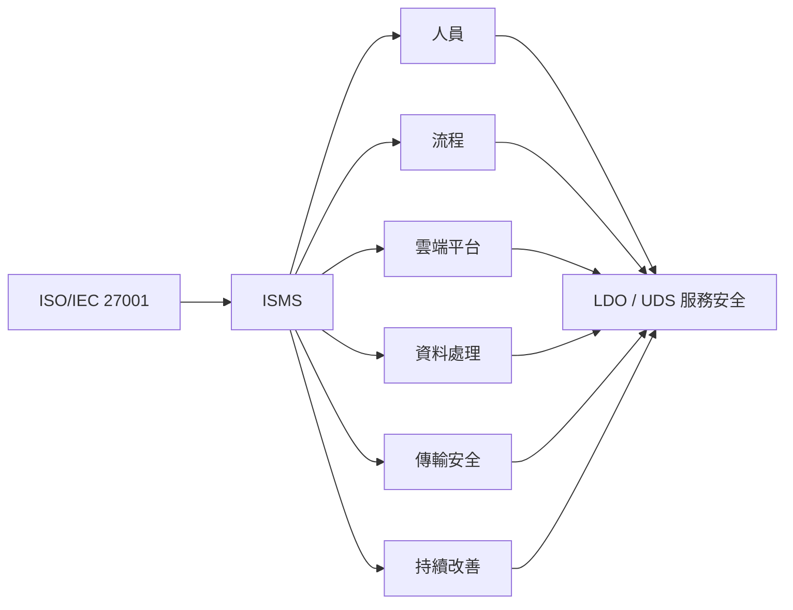
```mermaid
flowchart LR
    A[ISO/IEC 27001] --> B[ISMS]
    B --> C[人員]
    B --> D[流程]
    B --> E[雲端平台]
    B --> F[資料處理]
    B --> G[傳輸安全]
    B --> H[持續改善]
    C --> I[LDO / UDS 服務安全]
    D --> I
    E --> I
    F --> I
    G --> I
    H --> I
```

## LDO 產品的 ISO 27001 Scope 要怎麼看？

這裡最容易搞錯。

不能只說：

> Lenovo 有 ISO 27001。

要問：

> 哪一個組織單位？哪一個服務？哪一個平台？哪一段流程？哪一些資料處理活動？哪一些人員與技術系統？

Lenovo ISO 27001 頁面列出多個不同 certificate / scope。其中 UDS 的 ISO/IEC 27001 scope 明確限制在支援 Lenovo Users Devices Services Core cloud platform 的 ISMS，包含用來儲存、處理、傳輸 UDS core cloud platform and services 資料的人員與技術系統。

翻成白話：

> 認證重點是支撐 UDS Core cloud platform 的管理制度，以及相關人員、技術系統與資料處理/傳輸活動。

這不等於你可以自動假設所有 Lenovo 產品、所有地區、所有功能、所有客戶部署方式都被同一張證書完整涵蓋。

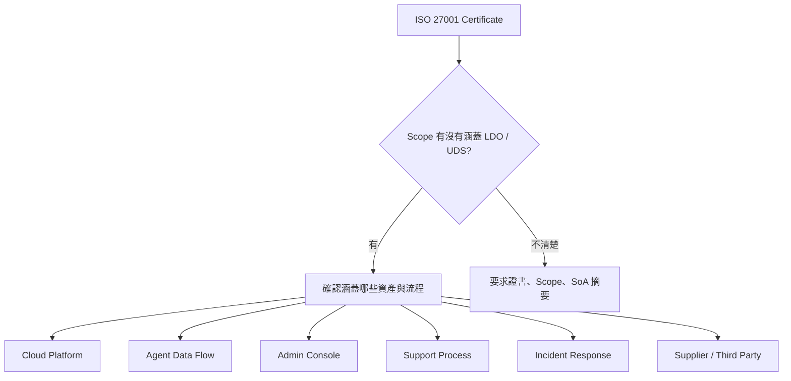
```mermaid
flowchart TD
    A[ISO 27001 Certificate] --> B{Scope 有沒有涵蓋 LDO / UDS?}
    B -->|有| C[確認涵蓋哪些資產與流程]
    B -->|不清楚| D[要求證書、Scope、SoA 摘要]
    C --> E[Cloud Platform]
    C --> F[Agent Data Flow]
    C --> G[Admin Console]
    C --> H[Support Process]
    C --> I[Incident Response]
    C --> J[Supplier / Third Party]
```

## LDO 類產品要保護哪些資訊資產？

ISO/IEC 27001 會先問：

> 你到底要保護什麼？

LDO 類產品要保護的資訊資產很多：

| 類型 | 例子 | 為什麼重要 |
|---|---|---|
| 裝置清單 | 公司有哪些筆電、平板、edge device | 外洩後可被攻擊者規劃攻擊 |
| 裝置健康資料 | 電池、更新狀態、系統版本 | 可推測弱點與未更新設備 |
| 作業系統資訊 | Windows / Ubuntu / Android 版本 | 可被用來找對應漏洞 |
| 管理員帳號 | IT admin、support role | 被盜後可管理大量裝置 |
| Agent 憑證 | agent 與 cloud 溝通識別資訊 | 被濫用可能偽裝裝置 |
| Log | 操作紀錄、事件紀錄 | 稽核與事件調查的重要證據 |
| 政策設定 | 更新政策、裝置管理規則 | 被改掉可能造成大規模風險 |
| 支援資料 | ticket、diagnostic data | 可能包含內部環境資訊 |

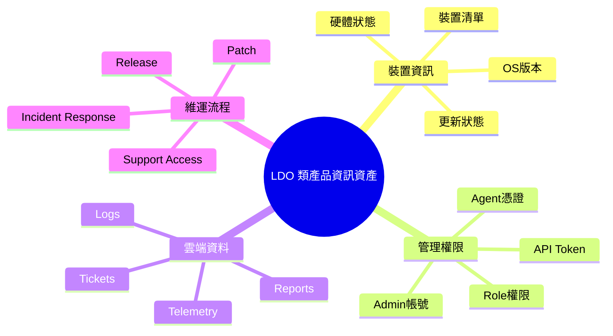
```mermaid
mindmap
  root((LDO 類產品資訊資產))
    裝置資訊
      裝置清單
      OS版本
      硬體狀態
      更新狀態
    管理權限
      Admin帳號
      Role權限
      API Token
      Agent憑證
    雲端資料
      Telemetry
      Logs
      Reports
      Tickets
    維運流程
      Patch
      Release
      Incident Response
      Support Access
```

## LDO 的資料流要怎麼用 ISO 27001 解釋？

一個 LDO 類產品大概會有這種流程：

1. Agent 安裝在 endpoint。
2. Agent 收集裝置狀態。
3. Agent 傳送資料到雲端平台。
4. 雲端平台處理、儲存、分析。
5. IT 管理員登入 console 查看。
6. 管理員派送政策或操作。
7. 系統產生 log、report、alert。
8. 支援團隊處理 incident 或 ticket。

```mermaid
sequenceDiagram
    participant Device as Endpoint Device
    participant Agent as LDO / UDC Agent
    participant Cloud as Lenovo UDS Cloud
    participant Admin as IT Admin Console
    participant Support as Support Team

    Device->>Agent: 裝置狀態 / 系統資訊
    Agent->>Cloud: 加密傳輸 telemetry
    Cloud->>Admin: Dashboard / Reports
    Admin->>Cloud: 政策設定 / 管理操作
    Cloud->>Agent: 指令 / 更新 / 設定
    Cloud->>Support: Ticket / Diagnostic context
    Support->>Cloud: 支援處理與紀錄
```

每一段都可以轉成 ISO 27001 問題：

| 資料流階段 | ISO 27001 會問什麼 |
|---|---|
| Agent 收集資料 | 是否只收必要資料？ |
| Agent 傳到雲端 | 是否加密？憑證如何管理？ |
| 雲端儲存 | 是否分租戶隔離？是否加密？ |
| Admin 登入 | 是否 MFA？是否 RBAC？ |
| 遠端操作 | 是否需要授權？是否可追蹤？ |
| Support 存取 | 是否有最小權限與 ticket 紀錄？ |
| Log 保存 | 保存多久？誰能查？是否防竄改？ |

## LDO 對應 ISO 27001 四類控制

ISO/IEC 27001:2022 Annex A 控制項可分成 organizational、people、physical、technological 四大類。套到 LDO 類產品，可以這樣講。

```mermaid
flowchart TD
    A[ISO 27001 Controls for LDO] --> B[Organizational]
    A --> C[People]
    A --> D[Physical]
    A --> E[Technological]
    B --> B1[產品安全治理 / 供應商 / 事件通報]
    C --> C1[支援人員存取 / 訓練 / 離職停權]
    D --> D1[辦公室 / 測試裝置 / Build與Signing環境]
    E --> E1[MFA / RBAC / 加密 / Log / Cloud Security]
```

### Organizational Controls

這一類在問：

> 公司有沒有把資安責任講清楚？

LDO 類產品要看：

- 誰是產品安全負責人？
- 誰負責雲端平台安全？
- 誰能核准 release？
- 誰能存取客戶資料？
- 供應商安全怎麼審查？
- 重大事件怎麼通報？
- 客戶合約中的安全責任怎麼寫？

```mermaid
flowchart TD
    A[組織管理控制] --> B[角色與責任]
    A --> C[風險評估]
    A --> D[供應商管理]
    A --> E[事件通報]
    A --> F[政策文件]
    B --> G[LDO 產品安全治理]
    C --> G
    D --> G
    E --> G
    F --> G
```

### People Controls

這一類在問：

> 人會不會成為破口？

LDO 類產品要看支援工程師、開發人員、營運人員、客服和管理員是否有清楚的權限邊界。

```mermaid
flowchart LR
    A[人員風險] --> B[到職]
    B --> C[教育訓練]
    C --> D[權限核發]
    D --> E[工作期間稽核]
    E --> F[離職權限回收]
```

### Physical Controls

雖然 LDO 是雲端服務，實體安全仍然存在，因為背後可能有辦公室、開發設備、測試裝置、build server、簽章流程與支援工作站。

```mermaid
flowchart TD
    A[LDO 背後實體資產] --> B[辦公室]
    A --> C[開發設備]
    A --> D[測試裝置]
    A --> E[Build / Signing 環境]
    A --> F[支援工作站]
    B --> G[門禁與訪客管理]
    C --> G
    D --> G
    E --> G
    F --> G
```

### Technological Controls

這是大家最直覺想到的資安，例如傳輸加密、憑證管理、MFA、RBAC、log monitoring、vulnerability management、secure coding、cloud security、backup、API security、tenant isolation。

Lenovo LDO requirements 頁提到，UDC 使用 certificate pinning。如果企業 proxy 做 TLS inspection，UDC 不支援這種被代理重新簽憑證的情境，需要排除 `*.uds.lenovo.com` 流量或關閉該 endpoint 的 TLS inspection。

這代表企業導入時不能只說「裝 agent 就好」，還要理解 agent-cloud 通訊、domain/port allowlist、proxy 政策與監控補位。

```mermaid
flowchart LR
    A[Endpoint Agent] -->|TLS / Certificate Pinning| B[Lenovo UDS Cloud]
    B --> C[Admin Console]
    C --> D[IT Admin]
    E[Enterprise Proxy] -.可能影響連線.-> A
    F[SIEM / Log Monitoring] --> C
    G[MFA / RBAC] --> C
```

## LDO 類產品的共同責任模型

使用 LDO 這種 SaaS / cloud endpoint management 產品時，安全責任不是全部丟給 Lenovo，也不是全部丟給客戶。

它是共同責任。

```mermaid
flowchart TD
    A[LDO 類產品安全] --> B[供應商責任]
    A --> C[客戶責任]
    A --> D[共同責任]
    B --> B1[Cloud 平台安全]
    B --> B2[Agent 安全設計]
    B --> B3[支援人員權限]
    B --> B4[產品漏洞修補]
    C --> C1[管理員帳號安全]
    C --> C2[裝置納管範圍]
    C --> C3[內部政策設定]
    C --> C4[防火牆與 Proxy 設定]
    D --> D1[事件通報]
    D --> D2[Log 稽核]
    D --> D3[權限審查]
```

供應商通常負責 LDO cloud platform、服務後台、agent 安全設計、產品漏洞修補、內部支援人員權限與 ISO 27001 scope 內的 ISMS 維持。

客戶通常負責哪些裝置要上 agent、自己的 IT admin 帳號、MFA、RBAC、內部政策、proxy / firewall allowlist、裝置基本安全、SIEM / MDM 整合與內部稽核。

## 實際場景：企業導入 LDO 管理 5,000 台筆電

假設一家金融公司有 5,000 台 Lenovo 筆電。導入 LDO 後，IT 可以看到哪些筆電 BIOS 過舊、driver 版本落後、裝置健康度異常、需要維護或可能有安全設定問題。

ISO/IEC 27001 要講的是：

> LDO 在幫企業集中管理裝置的同時，也產生一個高價值管理平台，因此必須保護平台權限、裝置資料、操作紀錄與更新流程。

```mermaid
flowchart TD
    A[金融公司 5000 台筆電] --> B[LDO Agent]
    B --> C[LDO Cloud]
    C --> D[IT Dashboard]
    D --> E[發現未更新裝置]
    D --> F[產生安全報告]
    D --> G[安排維護與更新]
    C --> H[ISO 27001 關注點]
    H --> I[資料加密]
    H --> J[管理員權限]
    H --> K[稽核紀錄]
    H --> L[事件應變]
```

具體審查問題包括：

- Admin 是否強制 MFA？
- 管理員是否分角色？
- 批次更新是否要審核？
- 裝置資料是否加密？
- 操作紀錄是否可稽核？
- 支援人員是否能直接看資料？
- 是否有 incident notification SLA？

## 實際場景：醫療院所使用 LDO 管理臨床裝置

醫療場景風險更高，因為裝置可能接觸病人資料、臨床工作流程、醫療影像、醫療軟體與院內網路。

```mermaid
flowchart TD
    A[醫療院所裝置] --> B[臨床使用]
    A --> C[LDO 管理]
    B --> D[病人資料風險]
    B --> E[臨床中斷風險]
    C --> F[裝置健康監控]
    C --> G[更新與維護]
    C --> H[遠端支援]
    F --> I[ISO 27001 控制]
    G --> I
    H --> I
    I --> J[權限]
    I --> K[紀錄]
    I --> L[事件應變]
    I --> M[供應商管理]
```

醫療情境會特別問：

- LDO 收到的 telemetry 是否包含病患資訊？
- 是否能避免收集不必要的臨床資料？
- 更新是否會影響臨床服務時間？
- 如果更新失敗，是否有 rollback？
- 支援人員是否能看到敏感資訊？
- 醫院如何保存管理操作紀錄？
- 醫療器材軟體若受影響，責任如何切分？

## 實際場景：工廠使用 LDO 管理 Edge Device

智慧工廠的 edge devices 可能負責產線監控、影像辨識、品質檢測、機台狀態回報與 AI inference。

風險也很清楚：

> 裝置管理平台如果出問題，可能影響產線穩定性。

```mermaid
flowchart LR
    A[工廠 Edge Devices] --> B[LDO Agent]
    B --> C[LDO Cloud]
    C --> D[IT / OT Team]
    D --> E[設備健康監控]
    D --> F[更新管理]
    D --> G[異常告警]
    E --> H[降低停機時間]
    F --> I[需控管更新風險]
    G --> J[需事件應變流程]
```

工廠情境會特別問：

- 更新能不能分批 rollout？
- 能不能設定維護時段？
- 是否有離線或連線不穩處理？
- 遠端操作是否要雙人核准？
- Log 能否串接 SIEM？
- 裝置憑證如何輪替？

## 實際場景：LDO 與 Microsoft Intune 整合

Lenovo 有 LDO 與 Microsoft Intune 的頁面，目前頁面可看到 NA / EMEA 使用者的 connect entry。這類整合情境適合保守地當成「MDM / endpoint management 生態整合」來看。

ISO/IEC 27001 的重點會變成：

> 當 LDO 與既有 MDM / endpoint management 生態整合時，資料流、權限邊界、API token、管理責任要清楚。

```mermaid
flowchart TD
    A[Microsoft Intune] --> B[裝置管理政策]
    C[Lenovo LDO] --> D[裝置健康與最佳化]
    B --> E[企業 Endpoint Fleet]
    D --> E
    A --> F[權限與 API 整合風險]
    C --> F
    F --> G[ISO 27001 控制]
    G --> H[API Key 管理]
    G --> I[RBAC]
    G --> J[Log]
    G --> K[供應商責任分界]
```

這裡要問：

- LDO 和 Intune 之間傳什麼資料？
- API 權限是否過大？
- token 如何保存？
- 兩邊 log 如何對齊？
- 如果 LDO 發生 incident，Intune 端要不要動作？
- 如果 Intune 帳號被盜，是否能間接影響 LDO？
- 兩個平台的 admin 權限是否分離？

## 對客戶講 LDO + ISO 27001 的簡報說法

可以這樣說：

> 對 Lenovo Device Orchestration 這類雲端裝置管理產品來說，ISO 27001 的重點在於確認供應商是否以可稽核的 ISMS 管理服務背後的人員、流程、雲端平台、資料處理、存取權限與事件應變。由於 LDO 透過 agent 收集裝置狀態並連接雲端管理平台，這類產品的資安風險集中在 endpoint telemetry、管理員權限、遠端操作能力、更新流程、支援人員存取與雲端服務配置。因此，ISO 27001 不只是採購時的合規證明，更是企業評估該產品是否能安全納入內部 endpoint management 架構的重要依據。

```mermaid
flowchart TD
    A[LDO 類產品導入評估] --> B[產品功能]
    A --> C[ISO 27001 Scope]
    A --> D[資料流]
    A --> E[權限模型]
    A --> F[事件應變]
    A --> G[客戶責任]
    B --> H[是否適合導入]
    C --> H
    D --> H
    E --> H
    F --> H
    G --> H
```

## 採購與資安審查應該要什麼？

不要只問：

> 有沒有 ISO 27001？

要問：

| 要求文件 / 答案 | 為什麼要 |
|---|---|
| ISO 27001 certificate | 確認有認證 |
| Certificate scope | 確認是否涵蓋 LDO / UDS 相關服務 |
| Statement of Applicability, SoA 摘要 | 看哪些 controls 被採用 |
| Data flow diagram | 知道資料怎麼流 |
| Data processing agreement | 知道資料處理責任 |
| Subprocessor list | 知道第三方服務商 |
| Security whitepaper | 看技術安全設計 |
| Penetration test summary | 看是否有測試 |
| Vulnerability management policy | 看漏洞怎麼修 |
| Incident response policy | 看出事怎麼通知 |
| Access control policy | 看人員權限怎麼管 |
| Data retention policy | 看資料保存多久 |
| Encryption details | 看傳輸與靜態資料加密 |
| Tenant isolation explanation | 看客戶資料是否隔離 |
| Backup / DR plan | 看平台故障如何復原 |
| SLA / support process | 看服務可用性與支援流程 |

```mermaid
flowchart TD
    A[供應商資安審查] --> B[證書]
    A --> C[Scope]
    A --> D[資料流]
    A --> E[權限]
    A --> F[事件應變]
    A --> G[第三方]
    A --> H[技術安全]
    B --> I[採購決策]
    C --> I
    D --> I
    E --> I
    F --> I
    G --> I
    H --> I
```

## LDO 類產品的 10 個 ISO 27001 審查問題

1. ISO 27001 scope 是否涵蓋 LDO / UDS cloud？
2. LDO agent 收集哪些資料？
3. Agent 到 cloud 的資料傳輸是否加密？
4. 管理員是否支援 MFA？
5. 權限是否能分角色，例如 viewer、device admin、security admin、support role、billing admin、super admin？
6. 遠端操作是否有完整 log？
7. 支援人員如何存取客戶資料？
8. 漏洞如何修補？
9. 重大 incident 如何通知客戶？
10. 客戶資料保存多久？退租後資料如何刪除？

```mermaid
flowchart TD
    A[10 個 ISO 27001 審查問題] --> B[Scope]
    A --> C[資料收集]
    A --> D[加密傳輸]
    A --> E[MFA / RBAC]
    A --> F[操作 Log]
    A --> G[支援存取]
    A --> H[漏洞修補]
    A --> I[事件通知]
    A --> J[資料保存與刪除]
```

## 一句話區分三件事

LDO 安全性至少要分成三層：

| 類型 | 問題 | 例子 |
|---|---|---|
| 產品安全 | LDO 本身設計是否安全？ | agent、cloud、console、API |
| 公司認證 | Lenovo 哪個部門或平台有 ISO 27001？ | UDS Core cloud platform ISMS |
| 客戶使用安全 | 企業是否正確設定與使用？ | MFA、RBAC、proxy、log、內部流程 |

```mermaid
flowchart LR
    A[LDO 安全性] --> B[產品安全]
    A --> C[供應商 ISO 27001 認證]
    A --> D[客戶部署與設定]
    B --> E[Agent / Cloud / Console]
    C --> F[ISMS Scope / Audit / Controls]
    D --> G[MFA / RBAC / Firewall / Internal Policy]
```

最精準的一句話：

> 對 LDO 類產品來說，ISO 27001 是在證明：這個裝置管理雲端服務背後，有一套可被稽核、可被追蹤、可持續改善的資訊安全管理制度。

# 一句話總結

ISO/IEC 27001 是一套讓組織能「有系統地保護資訊與管理風險」的國際資安管理標準。

它真正保護的不只是電腦，而是信任、商譽、客戶資料、公司營運、AI 系統、關鍵知識與組織流程。

```mermaid
flowchart LR
    A[ISO/IEC 27001] --> B[保護資訊]
    B --> C[降低風險]
    C --> D[建立信任]
    D --> E[讓組織能安全營運]
```

# Sources

- ISO official ISO/IEC 27001 page: https://www.iso.org/standard/27001
- LRQA ISO/IEC 27001:2022 publication note: https://www.lrqa.com/en-us/latest-news/iso-iec-27001-2022-published/
- NQA ISO/IEC 27001:2022 transition note: https://www.nqa.com/en-me/resources/news/iso27001-2022-published
- IAF MD 26 transition requirements PDF: https://iaf.nu/iaf_system/uploads/documents/IAF_MD_26_Transition_requirements_for_ISOIEC_27001-2022_09082022.pdf
- Lenovo Device Orchestration home: https://ldosupport.lenovocloudsoftware.com/portal/en/home
- Lenovo Device Orchestration requirements: https://ldosupport.lenovocloudsoftware.com/portal/en/kb/articles/lenovo-device-orchestration-requirements
- Lenovo ISO 27001 compliance page: https://www.lenovo.com/us/en/compliance/iso-27001/
- Lenovo Device Orchestration / Microsoft Intune page: https://www.lenovo.com/us/en/ldo-intune/
