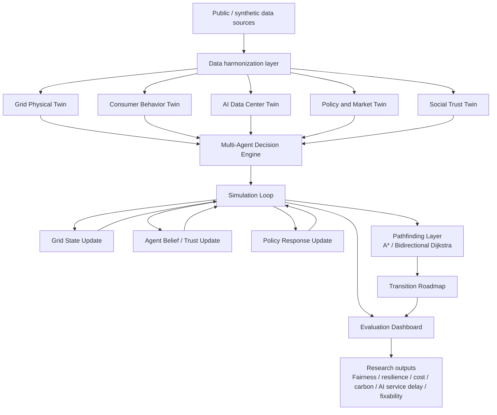
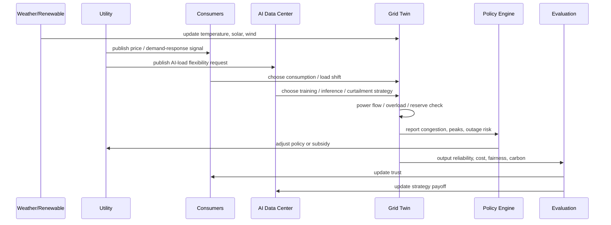

# AI-Aware Grid Decision Twin Power Grid Brainstorm

## Canonical Routing

This note owns the detailed power-grid brainstorming thread that grew out of the Japan local-systems / distributed-infrastructure conversation.

Repository roles:

| Repo | Role |
| --- | --- |
| `planning-everything-track` | capacity, daily/weekly status, project locator, durable lesson summary |
| `brainstorming-lab` | detailed brainstorm, assumptions, options, critique, graduation rationale |
| `ai-aware-grid-decision-twin` | executable prototype, configs, docs, scripts, evidence, manuscript assets |

Execution repo:

```text
../ai-aware-grid-decision-twin/
```

Planning locator:

```text
../planning-everything-track/data/projects/2026-04-ai-aware-grid-decision-twin.md
```

## Origin

The original question began from quiet Kyoto temples and Japanese regional banks as distributed local systems. The power-grid thread emerged when that distributed-vs-centralized architecture was applied to critical infrastructure, AI data centers, digital twins, and policy transition design.

## Detailed Power-Grid Brainstorm

### Energy and smart grids

Energy systems have strong feedback loops because users react to price, outages, and incentives.

Actors:
- central grid operator
- local utilities
- households
- factories
- renewable-energy providers
- storage providers
- regulators

Game-theory questions:
- Will users shift usage away from peak-price periods?
- Will local microgrids cooperate with the central grid?
- How do providers behave when renewable supply is unstable?

Simulation questions:
- How do outages cascade?
- What happens under heat waves or generation shortfall?
- Which pricing policies reduce peak load without harming vulnerable users?

Pathfinding questions:
- How can a traditional grid transition to smart grid / microgrid hybrid governance?
- Which path balances reliability, fairness, and cost?

### Smart-grid dataset fit for this research

Research need:

```text
The framework needs behavior, policy, grid stress, and transition-path data.
No single public smart-meter dataset fully covers all four.
```

Minimum data layers:
- consumption time series
- consumer / household / context features
- price, tariff, or demand-response intervention
- renewable / appliance / EV / battery signals where possible
- grid constraints or stress events
- policy rollout or institutional transition steps
- trust / behavior evolution signals

Dataset fit:

| Dataset | Strength | Gap | Best role |
| --- | --- | --- | --- |
| Australia Smart Grid Smart City Trial | Half-hour use, household data, appliance / climate / product offers, peak events, demand response | Not a full national grid-constraint dataset; some public fields may be incomplete for full institution modeling | Main system dataset for behavior + intervention + context |
| Ireland CER Smart Meter Trial | Strong tariff / customer-behavior trial, pre/post survey logic, residential and SME behavior | Weak grid-side constraints and renewable/AI-load context | Behavioral response and price-incentive model |
| London Smart Meter Dataset | Large scale, 5,567 households, half-hour readings, 167M rows, dToU subgroup and tariff signals | Limited individual behavioral context; not a full grid-state dataset | Scale, clustering, load-profile learning, tariff-response comparison |
| Pecan Street Dataport | High-resolution appliance/circuit-level data, EV / solar / battery / home audit style context depending access | Access/licensing constraints; sample bias; not a policy rollout dataset | Micro-behavior, EV/solar/battery/load flexibility calibration |

Current judgment:

```text
These datasets can support 80-90% of a first paper/prototype if combined, but they cannot alone support the full framework.
```

Recommended combination:
- Core pair: SGSC + CER.
- Scale supplement: London.
- Micro-behavior supplement: Pecan Street.

What needs simulation augmentation:
- policy rollout path
- grid stress events
- AI data-center load profiles
- trust decay / behavior evolution
- local vs central decision conflict
- attack or node-failure scenarios
- sparse or missing grid constraints such as reserve margin, feeder capacity, outage risk, and blackout propagation

Suggested simulation scale:

| Stage | Agents | Horizon | Use |
| --- | ---: | --- | --- |
| Pilot | 5,000-10,000 | 90-180 days, half-hour steps | Debug behavior rules and metrics |
| Paper-scale | 50,000-200,000 | 1-2 years, half-hour or hourly steps | Compare centralized, distributed, and hybrid policies |
| Stress-test | 100,000+ plus synthetic grid nodes | Heat wave / outage / AI-load surge windows | Test resilience, fairness, trust, and repairability |

Design rule:

```text
Do not generate synthetic load from nothing.
Use real datasets to learn agent types, load profiles, tariff response, and flexibility; then simulate missing governance, grid-stress, AI-load, trust, and attack layers.
```

### AI infrastructure and power-grid research branch

The power-grid extension reframes the problem:

```text
The grid used to serve mostly human life and industry.
It now also has to serve AI data centers, GPU clusters, and edge-AI infrastructure.
```

New conflict:
- Human loads need affordability, reliability, and fairness.
- AI training loads can be huge, concentrated, and sometimes schedulable.
- AI inference loads may be less deferrable.
- Data centers can stress local transmission, cooling, water, renewable procurement, and disaster resilience.

Research directions:

1. `AI vs Human Resource Game`
   - Players: data centers, households, utilities, government, local communities.
   - Question: who gets priority during peak demand or grid stress?

2. `AI-aware Smart Grid`
   - Grid controller sees AI workload classes.
   - Training jobs can shift or pause; inference has stricter latency/availability constraints.
   - Study pricing, demand response, and workload-shifting incentives.

3. `Data Center Placement Optimization`
   - Use pathfinding / optimization for site selection.
   - Costs: grid capacity, renewable availability, cooling, water, land, latency, political resistance, resilience.

4. `Grid Resilience under AI Load`
   - Simulate heat wave + renewable drop + AI training spike + feeder/generator outage.
   - Compare centralized dispatch, local microgrid autonomy, and hybrid control.

5. `AI-driven Demand Response`
   - Treat AI workloads as strategic agents.
   - Study whether AI operators voluntarily shift load, respond only to pricing, or require regulation.

Best paper candidates:

| Candidate | Core idea | Dataset / simulation path |
| --- | --- | --- |
| Game-Theoretic Demand Response under Heterogeneous Consumers | Model household/SME response to tariffs and incentives | CER + SGSC, with synthetic policy rounds |
| Strategic Transition Planning for Smart Grids using A*-Guided Simulation | Search transition paths from local autonomy to hybrid governance | SGSC/London profiles + simulated state transitions |
| AI-Aware Power Grid: Multi-Agent Resource Allocation between Human and AI Loads | Model data centers as strategic energy consumers alongside human loads | Real household baselines + synthetic AI load and grid stress |

Most original direction:

```text
AI-aware power-grid governance: human demand, AI infrastructure demand, policy incentives, grid constraints, and repairable decision systems in one multi-agent model.
```

### Digital twin clarification

Plain definition:

```text
Digital Twin = a simulation model that stays connected to the real system through data updates.
```

Simple contrast:

| Type | What it does | Relationship to reality |
| --- | --- | --- |
| Static model | Represents assumptions | No live update |
| Simulation | Tests scenarios with chosen parameters | Can be realistic but usually offline |
| Digital shadow | Real system sends data to model | One-way data flow |
| Digital twin | Model updates from the real system and may support prediction, optimization, and sometimes control | Dynamic, operational coupling |

Plain analogy:

```text
Simulation is like a city-building game.
Digital twin is like a city-building game whose map keeps updating from the real city.
```

What a grid digital twin can do:
- Monitor current load, congestion, outage risk, and asset state.
- Predict future stress under heat, renewable drop, EV charging, or AI training spikes.
- Test policies virtually before applying them in the real grid.
- Simulate blackouts, cascading failures, and cyberattack scenarios.
- Optimize demand response, storage dispatch, renewable integration, and maintenance.
- Search transition paths toward hybrid / AI-aware grid governance.

Three practical levels:

| Level | Name | Required infrastructure | Research use |
| --- | --- | --- | --- |
| Level 1 | Proto-digital twin / research twin | Historical datasets, models, simulation code | Enough for papers and early prototypes |
| Level 2 | Quasi-digital twin | Periodic or partial real data, smart-meter feeds, weather, market data | Scenario testing close to operations |
| Level 3 | Operational digital twin | IoT, smart meters, SCADA/EMS/DMS, streaming data, edge/cloud compute, low-latency communications, security controls | Real-time monitoring, decision support, and possible control |

Important answer:

```text
You do not need physical equipment to start research.
You need physical/streaming infrastructure only when the twin must stay synchronized with a real operating grid.
```

For this project, the first useful artifact is a `research twin`:
- real smart-meter/load datasets
- synthetic grid nodes and AI data-center loads
- policy and demand-response scenarios
- multi-agent behavior
- traceability/fixability logs
- pathfinding for transition plans

This is enough to test the research idea before any real IoT/SCADA integration.

### Decision-aware digital twin

Existing grid digital-twin work often focuses on:
- grid asset state
- power-flow simulation
- renewable integration
- maintenance
- cyberattack testing
- system operation and optimization

The proposed research direction is different:

```text
Traditional grid digital twin asks: what will the grid do?
Decision-aware digital twin asks: after humans, AI infrastructure, utilities, and policy actors react to each other, what will the grid and society do?
```

This adds four layers to a normal grid twin:

1. `Actor layer`
   - households, SMEs, factories, data centers, utilities, government, attackers, regulators.

2. `Decision layer`
   - pricing, deferral, demand response, priority rules, appeal, override, local vs central coordination.

3. `Governance layer`
   - fairness constraints, policy rollout, institutional pathfinding, accountability, audit.

4. `Repair layer`
   - trace wrong decisions, rollback, override, learn from incident, update policy.

Possible architecture:

```text
[Physical / historical grid data]
          |
          v
[Grid simulation twin] -> [Actor simulation] -> [Policy/pathfinding engine]
          |                       |                         |
          v                       v                         v
 [stress / outage / load]   [behavior / trust]    [transition route / fixability]
```

Why this matters:

```text
Power-grid digital twins exist.
AI-aware, multi-agent, governance-aware, repairable grid twins are still an open research opportunity.
```

Evidence anchors to verify later:
- Siemens describes digital twins as virtual models/representations using sensor data, simulations, and real-time operational data.
- TwinEU is building a concept for a pan-European electricity-system digital twin based on a federation of local twins.
- Smart-grid digital-twin reviews cover monitoring, operation, maintenance, renewable integration, and cyber/security challenges.
- Cyber-physical digital twin work is already used to replicate smart-grid attacks in laboratory settings.

### How researchers build grid digital twins without full real-grid data

Important reality:

```text
Most academic grid digital twins are not built from a complete real utility grid.
They are assembled from test systems, synthetic grids, public market/load data, limited real data, and simulation.
```

Why full real grid data is hard to obtain:
- Electricity networks are critical infrastructure; detailed topology can reveal attack paths and blackout weak points.
- Utilities treat topology, investment plans, and operational practices as sensitive commercial/operational information.
- Real grids are multi-layered and constantly changing: generation, transmission, substations, distribution feeders, protection systems, markets, and load-side assets.
- Distribution-level topology is especially hard to obtain publicly because it is granular, local, and security-sensitive.

Common data/model sources:

| Source type | Examples | What it provides | Limitation |
| --- | --- | --- | --- |
| Standard IEEE test cases | IEEE 14-bus, 39-bus, 118-bus; IEEE test feeders such as 123-node feeder | Public benchmark topology for power-flow, stability, feeder studies | Small or stylized; not a real city |
| Synthetic grids | ACTIVSg cases, synthetic Texas grids, TX-123BT, Texas2k | Realistic-looking large networks, sometimes with weather-dependent renewable/load profiles | Designed to resemble real systems but not reveal actual infrastructure |
| Public ISO/RTO data | CAISO OASIS, PJM Data Miner | Load, generation, prices, outages, market and operational data depending feed | Often aggregated; topology/security details limited |
| Public smart-meter datasets | SGSC, CER, London, Pecan Street | Demand-side load profiles, tariff response, household/appliance behavior | Usually not connected to real feeder topology |
| Weather / renewable models | solar/wind/weather reanalysis and generation models | Supply-side variability and stress conditions | Model assumptions matter |
| Simulation tools | power-flow, OPF, cascading failure, agent-based simulation | Missing links between topology, demand, supply, policy, and behavior | Depends on assumptions and validation |

Typical research assembly:

```text
1. Use IEEE or synthetic grid as the topology backbone.
2. Attach public load profiles to buses/feeders as demand-side behavior.
3. Add weather and renewable generation profiles for supply variability.
4. Add ISO/RTO price/load/market data if market behavior matters.
5. Add policy rules, demand-response rules, attack events, or outage scenarios.
6. Run simulation and validate whether outputs match known aggregate patterns.
```

This creates a:

```text
Pseudo digital twin / research twin
```

It is not a perfect clone of a real grid. It is a controlled research environment that is realistic enough to test mechanisms.

Correct research stance:

```text
The goal is not to reconstruct a real national grid 1:1.
The goal is to study system behavior under realistic constraints.
```

For this project:

| Layer | Practical choice |
| --- | --- |
| Topology | IEEE 118-bus, IEEE 123-node feeder, ACTIVSg, or synthetic Texas-style grid |
| Demand | SGSC, CER, London smart-meter profiles |
| Micro-flexibility | Pecan Street appliance / EV / solar / battery profiles if accessible |
| Supply | Weather-driven solar/wind generation model |
| Market / price | CAISO/PJM style public price/load feeds or synthetic tariffs |
| AI load | Synthetic AI training/inference workload profiles calibrated from literature |
| Behavior | Game-theory payoff + agent-based simulation |
| Policy | TOU, demand response, AI load control, subsidy, priority rules |
| Pathfinding | A* / Dijkstra-style search over institutional transition states |
| Evaluation | reliability, fairness, cost, carbon, trust, fixability, traceability |

Key takeaway:

```text
Existing grid digital twins mostly mirror physical systems.
This research can build a decision mirror: human + AI + policy + grid behavior under scarcity.
```

### Pheromone signal extension: route formation, trust, and congestion memory

Related canonical brainstorm:

```text
../ideas/ant-colony-pheromone-graph-search-social-simulation.md
```

The ant-colony / pheromone model adds a useful signal layer to the grid decision twin. A* and Dijkstra can search known transition paths once the state graph and edge costs are defined. A pheromone-style model is better for the part where repeated local decisions gradually create system-level patterns: overloaded feeders, trusted or distrusted policy paths, AI-load siting pressure, consumer response habits, and long-run route / resource concentration.

General signal rule:

```text
signal(t+1) = reinforcement + diffusion - decay
```

Grid interpretation:

```text
agent action = household, utility, AI data center, regulator, or market response
pheromone signal = learned attractiveness / congestion memory / trust memory
reinforcement = repeated successful use, low cost, high reliability, or accepted policy
diffusion = information spread across neighborhoods, market participants, platforms, or policy reports
decay = old grid-state information, stale trust, outdated price memory, or resolved congestion
penalty = outage, congestion, unfair burden, price shock, or policy backlash
```

This lets the twin distinguish four related questions:

| Question | Better tool |
| --- | --- |
| What is the shortest or lowest-cost transition path after costs are defined? | A* / Dijkstra |
| How do many local decisions gradually produce congestion, lock-in, or adaptation? | Agent-based pheromone signal simulation |
| Which policies shift behavior without creating new concentration effects? | Policy layer + signal update rules |
| How does trust recover, decay, or spread after visible grid events? | Social Trust Twin with reinforcement / diffusion / decay |

Possible grid-specific signals:

- `route_attractiveness`: which demand-response or curtailment option agents tend to choose.
- `congestion_memory`: whether a feeder, bus, or neighborhood is remembered as stressed.
- `trust_signal`: whether a policy is perceived as fair, reliable, and predictable.
- `ai_load_reputation`: whether an AI data center is seen as flexible infrastructure or burden-shifting demand.
- `policy_signal`: whether subsidies, dynamic pricing, or public AI-load controls are visible and credible.

This extension is especially relevant for second-order effects. For example, if many AI data centers choose the same low-cost zone, local grid stress may rise; if repeated curtailment falls on the same residential group, trust can decay; if a public dashboard makes true congestion visible, agents may distribute better. The research target is not only one optimal path, but how signal fields shape future choices.

### Why AI-aware power grids are not mature yet

Plain explanation:

```text
Current work is beginning to show that AI data centers can flex power use.
But the mature research problem is not only "can a data center reduce load?"
It is "how should society allocate grid capacity among humans, industry, AI infrastructure, utilities, and government under scarcity?"
```

The existing research and industry activity is growing fast, but it is still fragmented into separate blocks:

1. `Forecasting AI data-center electricity demand`
   - Studies estimate how much electricity AI training, fine-tuning, inference, cooling, and high-density compute will need.
   - This helps planners understand the size of the future problem.

2. `Data-center demand response`
   - Early industry work shows some machine-learning workloads can be shifted, paused, or reduced during grid stress.
   - This proves data centers are not always rigid loads.

3. `Grid impact and interconnection planning`
   - Grid studies ask whether transmission capacity, reserve margins, electricity markets, and infrastructure planning can absorb new AI loads.

4. `Flexible data-center simulation`
   - New simulation work studies how much power flexibility AI data centers can offer under demand-response or reserve programs.

What is still immature:

```text
These blocks are rarely integrated into one multi-agent governance model.
```

A mature AI-aware grid model would put these actors in the same system:
- households
- SMEs / factories
- AI data centers
- electric utilities
- grid operators
- local governments
- national regulators
- renewable providers
- storage providers

And it would evaluate:
- who gets electricity during peak stress
- which AI jobs can be delayed
- which AI jobs should not be delayed
- what incentives make data centers cooperate
- whether residents or SMEs are harmed
- whether the decision is traceable and appealable
- whether policy can move from today's grid to an AI-aware grid without breaking trust

Simple version:

```text
The immature version asks: can the data center use less electricity when asked?
The mature version asks: how should a society govern electricity when AI becomes a strategic, flexible, high-power actor?
```

AI workload classes:

| AI workload | Flexibility | Governance meaning |
| --- | --- | --- |
| Large model training | Often deferrable or schedulable | Good candidate for demand response |
| Batch inference | Sometimes deferrable | Can be shifted if SLA allows |
| Data preprocessing / evaluation | Usually deferrable | Can move to low-stress windows |
| Real-time inference | Less deferrable | Needs reliability and latency guarantees |
| Medical / emergency AI | Least deferrable | Should receive protected priority rules |

This creates a resource-allocation problem:

```text
During grid stress, should AI training pause before household cooling, hospital load, factory production, or transit infrastructure?
```

That is why this belongs in the same framework as fixability, fairness, local/global conflict, and strategic pathfinding.

Evidence anchors to verify later:
- Google announced data-center demand-response agreements involving ML workloads with utility partners including I&M and TVA.
- Nature Energy 2026 reported a field demonstration of AI data centers operating as grid-interactive/flexible assets.
- FlexDC / FlexDC-Sim style work is emerging around AI data-center power flexibility for demand-response participation.
- Recent AI-data-center grid-impact reviews frame AI load growth as a power-system planning, market, and reliability challenge.

### AI-Aware Grid Decision Twin research design

Working title:

```text
AI-Aware Grid Decision Twin: Multi-Agent Simulation and Pathfinding for Fair Smart Grid Transition under Data Center Loads
```

Prototype repo:

```text
/home/jnclaw/every_on_git_jnclaw/phd-life-system/ai-aware-grid-decision-twin/
```

Planning locator:

```text
data/projects/2026-04-ai-aware-grid-decision-twin.md
```

Chinese title:

```text
AI 感知電網決策數位分身：面向資料中心負載的公平智慧電網轉型模擬與路徑搜尋
```

Positioning:

```text
This is not a load-forecasting paper.
This is a decision-aware digital twin for human demand, AI infrastructure demand, policy incentives, and grid resilience.
```

Main research question:

```text
When AI data centers become large strategic and partly flexible loads, how should the grid allocate capacity among residents, SMEs, industry, AI infrastructure, utilities, and government while preserving reliability, fairness, cost control, carbon goals, and repairability?
```

#### Novelty claims

Novelty 1: model AI data centers as strategic electricity agents.

Most grid studies treat data centers as large loads. This design treats AI data centers as decision-making agents that can:
- defer training
- shift workloads across time or region
- reduce GPU utilization
- buy storage
- respond to demand-response rewards
- negotiate power contracts
- reject flexibility requests when SLA or profit losses are too high

Novelty 2: evaluate whether AI infrastructure displaces human electricity welfare.

The paper should not only ask:

```text
Does the data center create grid congestion?
```

It should ask:

```text
When grid capacity is scarce, which human groups absorb the cost of AI infrastructure growth?
```

Novelty 3: make the digital twin decision-aware.

Traditional grid twins often focus on voltage, line loading, outages, generation, assets, and dispatch. This design adds:
- consumer behavior change
- AI data-center strategy
- policy incentives
- social trust
- fairness constraints
- repairability and traceability

Novelty 4: use pathfinding for policy transition.

Most studies compare fixed scenarios. This design searches the path from current grid to AI-aware grid:

```text
Which policy sequence is low-cost, fair, resilient, and socially acceptable?
```

#### System architecture



One-line architecture:

```text
Data builds the twin; agents make decisions; simulation runs repeated interaction; pathfinding searches transition routes; metrics reveal tradeoffs.
```

#### Twin 1: Grid Physical Twin

Purpose:
- represent generation, transmission/distribution constraints, bus/feeder load, renewables, storage, line stress, reserve margins, and outage/stress events.

Minimum viable topology:

```text
IEEE 118-bus + one AI data-center node + residential/commercial/industrial loads
```

Larger research topology:

```text
ACTIVSg2000 or another synthetic large grid after the MVP is stable
```

Why synthetic grids are acceptable:
- They avoid critical-infrastructure disclosure risk.
- They support repeatable experiments.
- They allow policy and behavior experiments without claiming to operate a specific real utility grid.

Core outputs:
- peak load
- line overload hours
- reserve-margin violations
- renewable curtailment
- blackout-risk proxy
- local grid-stress score

#### Twin 2: Consumer Behavior Twin

Purpose:

```text
Convert real smart-meter patterns into household/SME/industrial agent types.
```

Candidate data:
- CER Smart Meter Trial for tariff and behavior response.
- London Smart Meter Dataset for large-scale half-hour profiles.
- Smart Grid Smart City for Australian context, offers, events, and demand response.
- Pecan Street for appliance, EV, solar, storage, and micro-flexibility when accessible.

Feature extraction:

```text
peak_ratio
night_ratio
weekend_shift
temperature_sensitivity
price_response
baseline_load
load_volatility
solar_presence
ev_presence
```

Agent types should come from clustering, not hand-picked proportions:
- peak-heavy rigid users
- price-responsive shifters
- night-load households
- temperature-sensitive users
- high-flexibility smart-home users
- low-income vulnerable users
- small-business operational users
- industrial schedulable users

The vulnerable-user group is important for fairness. It may need to be synthetic or inferred through proxies if income and household constraints are missing.

#### Twin 3: AI Data Center Twin

Purpose:

```text
Model AI data centers as strategic flexible-load agents.
```

AI workload classes:

| Workload | Flexibility | Grid meaning |
| --- | --- | --- |
| Pretraining | high | strong demand-response candidate |
| Fine-tuning | medium | partly shiftable |
| Batch inference | medium | shiftable if SLA permits |
| Real-time inference | low | needs reliability and latency |
| Data preprocessing | high | can move to low-stress windows |
| Evaluation / benchmarking | high | can defer |
| Emergency AI service | very low | should be protected |

Data center actions:

```text
A0 = normal operation
A1 = defer training
A2 = reduce GPU utilization
A3 = shift workload to another region
A4 = use battery/storage
A5 = buy high-price electricity
A6 = accept demand-response compensation
A7 = reject curtailment request
```

Data center utility:

```text
DataCenterUtility =
AI_service_value
- electricity_cost
- workload_delay_penalty
- SLA_violation_penalty
- carbon_penalty
+ demand_response_reward
+ reputation_score
```

Research stance:

```text
We do not claim to reconstruct proprietary data-center operation.
We model publicly discussed workload-flexibility classes and test sensitivity under controlled scenarios.
```

#### Twin 4: Policy and Market Twin

Actors:
- utility / ISO
- government
- regulator
- local community
- data-center operator

Policy actions:

| Policy | Intended effect |
| --- | --- |
| Flat pricing | baseline |
| TOU pricing | encourage load shifting |
| Critical peak pricing | reduce high-stress demand |
| Demand-response reward | pay for flexibility |
| AI load curtailment contract | make AI load dispatchable |
| Vulnerable-user protection | prevent rigid users from being punished |
| Battery subsidy | increase flexibility |
| Renewable matching | bind data centers to cleaner supply |
| Grid connection queue rule | control large-load interconnection |

Policy utility:

```text
PolicyUtility =
grid_reliability
+ fairness_score
+ carbon_reduction
- subsidy_cost
- public_backlash
- industry_resistance
```

#### Twin 5: Social Trust Twin

Purpose:

```text
Represent policy legitimacy and user trust as state variables, not afterthoughts.
```

Why this matters:
- Dynamic pricing can look like punishment to vulnerable households.
- Data centers can be perceived as taking electricity capacity from residents and SMEs.
- Subsidies can be seen as favoring large firms.
- A technically efficient policy can fail if trust collapses.

Trust update:

```text
trust_t+1 =
trust_t
+ perceived_saving
+ service_reliability
- unfair_bill_increase
- blackout_experience
- policy_complexity_penalty
```

Trust is not claimed to be a calibrated psychological truth in the MVP. It is a sensitivity variable used to test whether policy conclusions survive different social-reaction assumptions.

#### Simulation loop

One simulation round can represent one day or one week.



#### State space and pathfinding

Institution states:

```text
S0 = Traditional Grid
No smart-meter coverage, fixed pricing, data centers not participating in grid dispatch.

S1 = Metered Grid
Smart meters exist, but policy remains conservative.

S2 = TOU Grid
Time-of-use / dynamic pricing begins.

S3 = Demand Response Grid
Residential, commercial, and industrial demand response begins.

S4 = AI-aware Grid
AI data centers become schedulable or contractually flexible loads.

S5 = Coordinated Smart Grid
Human users, AI data centers, storage, and renewables coordinate under central standards and local execution.

SX = Failure State
Trust collapse, blackout, excessive cost, fairness failure, or cybersecurity failure.
```

Transition cost:

```text
transition_cost =
infrastructure_cost
+ political_cost
+ user_discomfort
+ fairness_loss
+ cybersecurity_risk
+ implementation_complexity
- reliability_gain
- carbon_reduction
```

A* heuristic:

```text
h(state) =
remaining_meter_gap
+ remaining_flexibility_gap
+ remaining_policy_gap
+ remaining_trust_gap
+ remaining_AI_coordination_gap
```

Pathfinding question:

```text
From S0 to S5, what path reaches an AI-aware coordinated smart grid with the lowest acceptable cost and risk?
```

Potential paths:

```text
Path A: S0 -> S1 -> S2 -> S3 -> S4 -> S5
Path B: S0 -> S1 -> S3 -> S4 -> S5
Path C: S0 -> S2 -> SX
```

Possible insight:

```text
Direct high-intensity dynamic pricing may be technically efficient but socially unstable if trust and vulnerable-user protection are not ready.
```

#### Game-theory design

Players:
- utility
- residential users
- industrial / SME users
- AI data center
- government / regulator

Utility actions:
- flat pricing
- TOU pricing
- critical peak pricing
- demand-response reward
- curtailment request

Residential actions:
- shift load
- do nothing
- adopt smart appliance
- install battery
- complain / distrust / opt out where possible

AI data-center actions:
- normal operation
- delay training
- shift workload
- buy battery
- accept demand response
- reject demand response

Government actions:
- subsidize battery
- protect vulnerable users
- mandate AI flexibility
- approve / delay data-center grid connection

Equilibrium questions:
- Under what conditions will an AI data center voluntarily curtail load?
- Under what conditions will residents shift load?
- When does the government need subsidies or mandates?
- When does market pricing fail?
- When do local and central policy goals conflict?

#### Evaluation metrics

Grid metrics:
- peak load reduction
- load-factor improvement
- line-overload hours
- reserve-margin violation
- blackout-risk proxy
- renewable curtailment

Economic metrics:
- total system cost
- consumer bill change
- data-center delay cost
- utility operational cost
- subsidy cost

Fairness metrics:
- bill burden by user group
- energy-poverty proxy
- vulnerable-user penalty
- regional inequality
- AI-load privilege index

New metric 1: AI Load Displacement Index.

```text
ALDI =
Human_load_curtailment_due_to_AI
/
Total_AI_load_added
```

Interpretation:

```text
Higher ALDI means AI load is displacing or burdening human electricity use more strongly.
```

New metric 2: Grid Negotiability Score.

```text
GNS =
(shiftable_human_load + shiftable_AI_load + available_storage)
/
peak_demand
```

Interpretation:

```text
Higher GNS means the grid has more negotiable flexibility before resorting to harmful curtailment.
```

New metric 3: Trust-Adjusted Reliability.

```text
TAR =
reliability_score * average_trust_score
```

Interpretation:

```text
A technically reliable but socially distrusted grid is not a stable real-world system.
```

#### Dataset mapping

MVP:

| Module | Data |
| --- | --- |
| Grid topology | IEEE 118-bus |
| Residential behavior | CER Smart Meter Trial |
| Large-scale load profiles | London Smart Meter Dataset |
| AI data-center load | synthetic workload based on public flexibility assumptions |
| Renewable | weather + solar/wind generation model |
| Policy | synthetic TOU / DR / AI curtailment scenarios |

Paper-strength version:

| Module | Data |
| --- | --- |
| Grid topology | ACTIVSg2000 |
| Consumer clustering | CER + London |
| Appliance / PV / EV behavior | Pecan Street if accessible |
| Demand-response validation | CER TOU trial and SGSC events |
| Data-center flexibility | Google public demand-response reports + data-center flexibility literature |
| Extreme scenario | heatwave + renewable drop + AI training spike |

#### Experiments

Experiment 1: Consumer Agent Grounding.

Goal:

```text
Use real smart-meter data to generate agent types.
```

Pipeline:

```text
CER / London smart meter
-> feature extraction
-> clustering
-> cluster interpretation
-> agent type distribution
```

Output:
- agent type proportions
- typical load curves
- price response
- flexibility level

Experiment 2: AI Data Center Flexibility.

Scenarios:

```text
DC-0 = data center does not curtail
DC-1 = only training can be deferred
DC-2 = training + batch inference can shift
DC-3 = data center has battery
DC-4 = cross-region workload migration
```

Metrics:
- peak reduction
- AI delay cost
- blackout-risk proxy
- renewable utilization

Experiment 3: Fairness under AI Load.

Scenarios:

```text
No AI load
AI load without flexibility
AI load with voluntary demand response
AI load with mandatory flexibility
AI load with vulnerable-user protection
```

Metrics:
- ALDI
- bill increase by cluster
- energy-poverty proxy
- trust decay

Experiment 4: Policy Pathfinding.

Candidate paths:

```text
Path A = smart meters -> TOU -> DR -> AI flexibility
Path B = AI data-center regulation -> industrial DR -> residential TOU
Path C = industrial DR -> household DR -> AI curtailment contract
Path D = direct nationwide dynamic pricing
```

Outputs:
- lowest-cost path
- most fair path
- most resilient path
- fastest path
- path with lowest trust loss

Expected paper-worthy insight:

```text
The fastest path is not necessarily stable.
The cheapest path may be unfair.
The fairest path may require trust and repairability infrastructure before aggressive pricing.
```

#### Baselines

| Baseline | Meaning |
| --- | --- |
| Flat pricing | fixed-price baseline |
| TOU only | time-of-use pricing without other coordination |
| DR only | demand response without AI-specific modeling |
| Grid-only optimization | optimize physical grid only, no behavior/trust layer |
| DC-only flexibility | only require data center curtailment |
| No-trust model | remove trust decay and social legitimacy |
| Proposed Decision Twin | full model with grid + behavior + AI + policy + trust + pathfinding |

Safe claim:

```text
The proposed framework reveals tradeoffs that single-layer optimization misses.
```

Do not claim:

```text
The proposed system is always better.
```

#### Implementation architecture

Suggested stack:

```text
Python
pandas / numpy
scikit-learn
PyTorch optional
NetworkX
pandapower or PyPSA
Mesa or custom agent simulator
FAISS optional for embedding retrieval
matplotlib / plotly
```

Repository shape:

```text
ai_aware_grid_decision_twin/
├── README.md
├── configs/
│   ├── experiment_mvp.yaml
│   ├── experiment_ai_load.yaml
│   └── experiment_pathfinding.yaml
├── data/
│   ├── raw/              # gitignored
│   ├── interim/          # gitignored
│   ├── processed/        # gitignored
│   └── synthetic/
├── docs/
│   ├── research_charter.md
│   ├── dataset_mapping.md
│   ├── agent_taxonomy.md
│   ├── assumptions_register.md
│   └── risk_boundary.md
├── src/
│   ├── data/
│   │   ├── load_cer.py
│   │   ├── load_london.py
│   │   └── feature_engineering.py
│   ├── clustering/
│   │   ├── load_profile_features.py
│   │   └── cluster_agents.py
│   ├── grid/
│   │   ├── build_ieee118.py
│   │   ├── power_flow.py
│   │   └── stress_events.py
│   ├── agents/
│   │   ├── residential.py
│   │   ├── industrial.py
│   │   ├── data_center.py
│   │   ├── utility.py
│   │   └── regulator.py
│   ├── simulation/
│   │   ├── engine.py
│   │   ├── step.py
│   │   └── trust_update.py
│   ├── pathfinding/
│   │   ├── state_space.py
│   │   ├── astar.py
│   │   └── costs.py
│   ├── metrics/
│   │   ├── grid_metrics.py
│   │   ├── fairness_metrics.py
│   │   ├── trust_metrics.py
│   │   └── ai_metrics.py
│   └── visualization/
│       └── dashboard.py
├── experiments/
│   ├── exp01_agent_grounding/
│   ├── exp02_ai_flexibility/
│   ├── exp03_fairness/
│   └── exp04_pathfinding/
├── results/
│   ├── tables/
│   ├── figures/
│   └── logs/
└── manuscript/
    ├── paper.tex
    └── figures/
```

#### Six-week MVP roadmap

Week 1: data and agent grounding.

```text
Download / organize CER or London.
Extract load features.
Cluster users.
Generate agent taxonomy.
```

Week 2: grid MVP.

```text
Build IEEE 118-bus.
Map agent clusters to buses.
Create daily load curves.
Run power flow.
```

Week 3: AI Data Center Twin.

```text
Add AI data-center node.
Design workload profile.
Add flexibility actions.
Test peak-stress scenarios.
```

Week 4: policy simulation.

```text
Add TOU / DR / AI curtailment.
Run 100-500 rounds.
Output grid + cost + fairness metrics.
```

Week 5: pathfinding.

```text
Build S0-S5 state space.
Define transition costs.
Run A*.
Compare policy paths.
```

Week 6: paper-ready results.

```text
Run ablations.
Create tables and figures.
Write limitations.
Write novelty claims.
```

#### Paper contributions

Suggested contribution statement:

```text
1. We propose a decision-aware digital twin framework for AI-aware power grids.

2. We model AI data centers as strategic flexible-load agents instead of passive demand nodes.

3. We integrate consumer behavior clustering, game-theoretic interaction, grid simulation, and pathfinding-based transition planning.

4. We introduce fairness and trust-aware metrics, including AI Load Displacement Index and Trust-Adjusted Reliability, to evaluate whether AI infrastructure growth shifts grid burden onto human users.
```

#### Reviewer attack surface and responses

Attack 1: AI data-center load is synthetic.

Response:

```text
We do not claim to reconstruct proprietary data-center operation.
We model publicly documented flexibility classes and evaluate policy sensitivity under controlled scenarios.
```

Attack 2: This is not a real utility grid.

Response:

```text
We use synthetic grids to avoid critical-infrastructure disclosure risks.
The study focuses on behavioral and policy dynamics, not operational dispatch of a specific national grid.
```

Attack 3: The trust model is subjective.

Response:

```text
Trust is used as a sensitivity variable, not as a calibrated psychological truth.
We report robustness across parameter ranges.
```

Attack 4: The framework has too many modules.

Response:

```text
Ablation studies isolate each module:
consumer heterogeneity, AI flexibility, trust update, and pathfinding.
```

#### One-sentence contribution

```text
This system redefines the power grid from a physical infrastructure into a decision system where humans, AI, policy, and energy compete and coordinate under scarcity.
```

### Inferring regional structure from grid load profiles

The second research branch asks:

```text
Can electricity-load data help infer a region's population, residential/commercial/industrial mix, and daily habits?
```

Short answer:

```text
Yes, but as probabilistic inference, not exact reconstruction.
```

Why it is possible:
- Residential areas have daily morning/evening patterns.
- Commercial districts often peak during business hours.
- Industrial loads may be flatter, process-driven, or shift-based.
- Weather-sensitive regions show cooling/heating signatures.
- EV, solar, battery, and appliance-level patterns can create identifiable shapes.
- Smart-meter and load-profile studies already infer household characteristics and cluster usage types from consumption patterns.
- Substation-level studies already work on disaggregating aggregate load curves into typical component curves.

What it can estimate:
- residential share
- commercial share
- industrial share
- approximate population density
- workday vs weekend rhythm
- heating/cooling dependence
- EV or solar penetration clues
- load flexibility
- likely response to dynamic pricing

Important limitation:

```text
Do not infer population or industry mix from power plants alone.
```

Reasons:
- Electricity flows across regions.
- Power plants serve the grid, not only their immediate neighborhood.
- Substation service areas do not always match administrative boundaries.
- Grid topology and security constraints may be unavailable.
- Industrial facilities can dominate load without matching population size.

Better unit of analysis:
- feeder load profiles
- secondary substation load profiles
- distribution-zone load profiles
- utility service territories
- regional aggregated smart-meter profiles

Better input stack:

```text
load curve + GIS + weather + land use + demographics + business registry + building stock + night-light or satellite proxies
```

Possible method:

1. Build `load-profile embeddings`.
2. Cluster regions by shape, seasonality, peak timing, ramp rate, weekend/weekday difference, and weather sensitivity.
3. Train regression or Bayesian inference models with known regions.
4. Predict unknown or less-documented regions.
5. Validate across countries.

Cross-country validation idea:

```text
Train on one country with rich metadata.
Test transfer on another country such as Japan, the UK, Ireland, Australia, or the US.
Measure where the model fails because local culture, climate, industry, and grid topology differ.
```

This is not just prediction. It can become:

```text
Grid Region Digital Twin for AI Infrastructure Planning
```

Workflow:

1. Infer a region's electricity-use structure from load profiles and public context data.
2. Add candidate AI data-center load.
3. Simulate grid stress, pricing, demand response, fairness, and trust effects.
4. Search transition paths for where and how to add AI infrastructure without harming local residents and SMEs.

Key research question:

```text
If an AI data center enters this region, who changes behavior, who pays the cost, and what governance path keeps the grid reliable and fair?
```

Evidence anchors to verify later:
- Smart-meter load-profile research has inferred household characteristics from consumption profiles.
- Electricity load forecasting reviews confirm common use of weather, economic variables, historical consumption, and lifestyle factors.
- Substation-level disaggregation research estimates component load curves from aggregated low-voltage network data.


### Paper experiment visualization management

The `AI-Aware Grid Decision Twin` paper path should treat visualization as
experimental evidence, not only as presentation material.

Execution repo:

```text
../ai-aware-grid-decision-twin/
```

Key artifacts:

```text
docs/visualization_protocol.md
scripts/run_visualization_demo.py
requirements.txt
```

The visualization layer should preserve:

- synthetic or real simulation logs
- grid topology stress snapshots
- load, grid-stress, trust, fairness, ALDI, GNS, and TAR time-series figures
- agent behavior visualizations
- policy before/after comparison charts
- pathfinding state graph
- before/after diff CSVs and PNGs
- per-run experiment report
- optional Streamlit dashboard

Required snapshot stages:

```text
baseline
AI load only
policy active
AI-aware flexibility
final state
```

Research reason:

```text
The paper should not only claim that a policy or architecture is better.
It should show how the system changed stage by stage, which actors moved,
which nodes became stressed, and which metric improved at the cost of another.
```

Prototype command:

```bash
python3 scripts/run_visualization_demo.py --run-demo
```

Paper-ready replacement path:

```text
Synthetic logs -> CER/London/SGSC-derived consumer clusters
Synthetic graph -> IEEE 118-bus or ACTIVSg topology
Stress proxy -> pandapower or PyPSA power-flow outputs
Synthetic AI load -> literature-grounded AI workload classes
Synthetic trust -> sensitivity analysis over trust parameters
```
