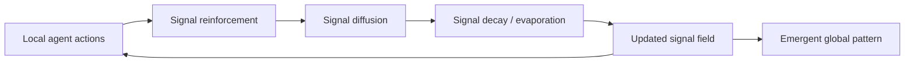
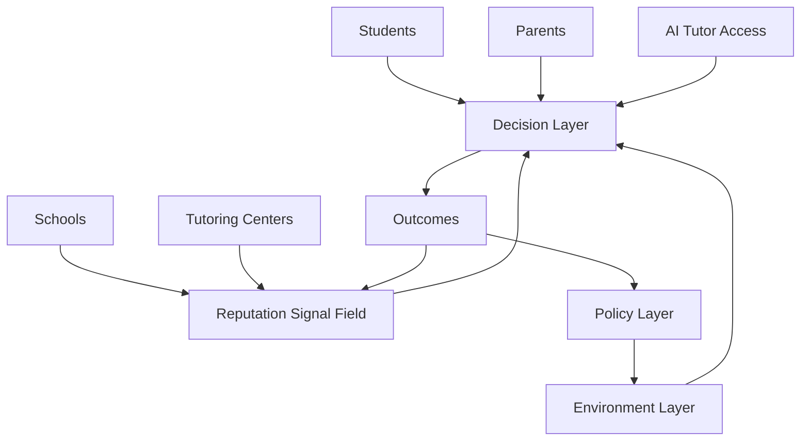

# Ant Colony Pheromone, Graph Search, and Social Signal Simulation

Recorded: 2026-05-02

Related notes:

- `../../planning-everything-track/data/knowledge/personal/ideas/japan-local-systems-as-legacy-distributed-infrastructure.md`
- `../../planning-everything-track/data/projects/2026-04-ai-aware-grid-decision-twin.md`
- `../ideas/ai-aware-grid-decision-twin-power-grid-brainstorm.md`
- `../ideas/taiwan-academic-research-team-scale-structure-incentives.md`

## Context

這份筆記來自一次關於 `ANT COLONY PHEROMONES` 圖像的討論。圖中展示螞蟻如何透過費洛蒙在 nest 與 food 之間形成路徑。討論逐步延伸到 Dijkstra、A*、蟻群模型的差異，以及這些方法能否用於道路交通最佳化與社會系統模擬。最後，這個想法被連結到教育資源分配、`reputation_signal`、AI tutor、補教業、詐騙資訊擴散與 `digital twin` research。

這仍是 brainstorming 階段的研究備忘錄，尚未代表已完成 simulation、實驗或 empirical validation。

## Ant Colony Pheromone Model

蟻群費洛蒙模型的核心是 `stigmergy`：個體不需要中央指揮，牠們透過環境留下的訊號間接協調。

在螞蟻找食物的情境中：

- 螞蟻沒有中央指揮。
- 每隻螞蟻只根據局部資訊行動。
- 螞蟻會隨機探索環境。
- 找到食物後，返回 nest 的路上會留下 `pheromone`。
- 其他螞蟻更容易跟隨費洛蒙較強的路徑。
- 常被走的路會被強化。
- 少人走的路會因為費洛蒙揮發而逐漸消失。
- 經過一段時間後，系統可能收斂出一條高效率路徑。

這裡可以用一句系統設計語言描述：

```text
簡單個體 + 局部互動 + 時間累積 -> 全局結構 / 集體智慧
```

關鍵在於 simulation：每個 agent 的規則可以很簡單，但當訊號會被強化、擴散與衰退時，整體系統會形成可觀察的路徑、熱區、鎖定效應或分流結果。這使得 pheromone model 很適合拿來研究路徑形成、資源集中、聲望擴散與社會選擇。

## Formula Interpretation

原圖中的公式可整理為：

```latex
\frac{\partial \tau}{\partial t} = \Delta \tau + D\nabla^2 \tau - \rho\tau
```

符號解釋：

- `τ`：某位置上的費洛蒙濃度。
- `∂τ/∂t`：費洛蒙濃度隨時間的變化。
- `Δτ`：螞蟻經過後新增的費洛蒙。
- `D∇²τ`：費洛蒙向周邊擴散。
- `ρτ`：費洛蒙揮發或衰減。

直覺版：

```text
trail growth = recruitment + diffusion - evaporation
費洛蒙變化 = 新增費洛蒙 + 擴散 - 揮發
```

一般化後，可以寫成社會系統訊號模型：

```text
signal(t+1) = reinforcement + diffusion - decay
```

這個框架可對應到：

- 聲望累積。
- 口碑傳播。
- 路況資訊更新。
- 詐騙話術擴散。
- 學校 `reputation_signal`。
- 平台推薦系統中的內容熱度。
- 補教業與 AI tutor 的資訊流。
- 政策或事件造成的系統擾動。

在社會系統中，`signal` 很少等於 ground truth。它常是被觀察、被轉述、被推薦、被放大、被延遲或被扭曲後的感知訊號。

## Conceptual Flow



## Dijkstra、A* 與蟻群模型的差異

### Dijkstra

Dijkstra 的前提是：

```text
地圖完整、graph 已知、每條邊的成本已知
```

它做的事情：

```text
從起點向外擴展，永遠選目前已知成本最低的節點，最後保證找到最短路徑。
```

特性：

- 適合完整 graph。
- 適合 edge cost 穩定的情境。
- 可以保證最短路徑。
- 探索範圍可能較大。
- 在大型圖或即時變動環境中，運算成本可能偏高。

### A*

A* 的核心公式：

```text
f(n) = g(n) + h(n)
```

其中：

- `g(n)`：從起點走到目前節點的實際成本。
- `h(n)`：從目前節點到終點的估計成本。
- `f(n)`：總評估分數。

特性：

- 加入 heuristic 後，搜尋方向更明確。
- 在地圖完整且 heuristic 合理時，通常比 Dijkstra 更快。
- 如果 heuristic 是 admissible / consistent，可以保證最短路徑。
- 如果 heuristic 很弱，可能退化得接近 Dijkstra。
- 適合導航、遊戲 pathfinding、機器人路徑規劃等問題。

### 蟻群 / Pheromone / ACO / Stigmergy

蟻群模型的核心前提是：

```text
環境可能未知、資訊不完整、系統會隨時間變化、個體只能根據局部訊號行動。
```

特性：

- 不一定保證找到全域最短路。
- 常用於近似最佳化。
- 適合動態、不確定、多代理人互動的問題。
- 可以模擬 `emergent behavior`。
- 可用在 TSP、VRP、物流配送、動態交通、網路路由、社會選擇、聲望形成等問題。
- 強項在於讓路徑透過互動逐漸形成，而非一次性算出固定答案。

核心差異：

```text
Dijkstra / A* 在已知世界中找路；蟻群模型在未知或動態世界中讓路逐漸長出來。
```

## Method Comparison Table

| 方法 | 前提 | 是否需要完整地圖 | 是否保證最短路 | 是否適合動態環境 | 主要用途 | 適合的研究問題 |
| --- | --- | --- | --- | --- | --- | --- |
| Dijkstra | graph 與 edge cost 已知且相對穩定 | 是 | 是 | 較弱，需要頻繁重算 | 最短路、網路路由、基礎 pathfinding | 已知路網中，從 A 到 B 的最低成本路徑是什麼 |
| A* | graph 已知，且有合理 heuristic 指向目標 | 是 | 在 admissible / consistent heuristic 下可以保證 | 中等，動態變化時需更新成本或重算 | 導航、遊戲、機器人路徑規劃 | 如何更有效率地找到目標路徑 |
| Ant Colony Optimization / Pheromone Model | 環境可部分未知，路徑品質由反覆互動更新 | 不一定 | 否，通常是近似最佳化 | 強 | TSP、VRP、物流、動態路由、聲望形成 | 路徑或選擇如何在局部互動與訊號累積中形成 |
| Agent-Based Simulation with Pheromone Signal | 多個 agent、環境、訊號場與時間更新規則 | 不一定 | 否 | 強 | 交通流、教育選擇、詐騙擴散、平台熱度、政策模擬 | 個體選擇、訊號強化與衰退如何產生整體模式 |

## 道路交通優化中的應用

### 靜態路徑規劃

適合方法：

- Dijkstra。
- A*。

適合情境：

- 地圖已知。
- 道路成本穩定。
- 要找單一路徑。
- 導航、配送、遊戲 pathfinding。

A* 可以利用 heuristic 導向終點，因此常比 Dijkstra 更有效率。若目標明確、道路成本可信，A* 是很自然的個體路徑規劃工具。

### 動態交通流模擬

適合方法：

- Ant Colony Optimization。
- Agent-Based Model。
- Pheromone-like signal model。

對應關係：

```text
車輛 = agent
道路 = graph edge
路口 = graph node
費洛蒙 = route attractiveness / historical travel time / congestion memory
揮發 = 舊路況資訊失效
擴散 = 交通資訊傳播
強化 = 車輛成功通過、時間較短、路線被更多車採用
懲罰 = 塞車、事故、延遲
```

可觀察問題：

- 車流是否自動分散。
- 熱門路線是否造成擁塞。
- 即時路況資訊如何改變選擇。
- 事故或道路封閉如何影響系統。
- 導航 app 是否會造成新的集中化問題。
- 個體最佳選擇是否會導致整體效率下降。

### 混合式交通系統

一個可研究的 hybrid model：

```text
A* / Dijkstra：負責個體車輛的即時路徑規劃
Pheromone / Agent-Based Model：負責模擬群體交通流與未來壅塞
Policy Layer：負責調整道路定價、號誌、限速、分流策略
Visualization Layer：負責呈現路網壅塞變化與路徑演化
```

研究價值：

- 同時處理 individual routing 與 collective traffic dynamics。
- 測試政策介入前後差異。
- 模擬導航系統對城市交通造成的二階效應。
- 探索短期最短路與長期系統穩定之間的衝突。

## 社會系統中的延伸應用

### 教育資源分配與升學選擇

這是本次對話最重要的研究延伸之一。教育系統中的選擇並不只是「哪所學校最好」的靜態排序問題；學生與家長通常只能看到部分訊號，並受到家庭資源、交通成本、補習資訊、同儕模仿與政策制度影響。

對應關係：

```text
學生 = agent
家長 = decision influencer
學校 = node / institution
補習班 = signal amplifier / intervention node
AI tutor = alternative learning resource / decentralized support
reputation_signal = pheromone
考試成績 / 升學率 / 競賽成果 = observable signal
真實教育品質 = latent ground truth
政策 = environmental intervention
交通距離 / 學費 / 家庭資源 = cost function
```

`reputation_signal` 不應該直接等於學校排名。它應該是一個感知變數：

```text
reputation_signal = perceived signal
```

可能組成因素：

- 學校排名。
- 升學率。
- 家長口碑。
- 社群討論。
- 媒體報導。
- 補習班推薦。
- 校友成功故事。
- 地區傳統印象。
- 學校品牌。
- 競賽成果。
- 師資流動。
- 負面新聞。
- AI tutor 的替代效果。
- 交通便利性。
- 家庭社經地位造成的資訊偏差。

建模時應拆開三層：

```text
1. Ground Truth Quality
   - instruction_quality
   - teacher_quality
   - learning_gain
   - student_support
   - learning_environment

2. Observable Metrics
   - exam_scores
   - college_admission_rate
   - competition_awards
   - dropout_rate
   - teacher_student_ratio

3. Perceived Reputation Signal
   - ranking
   - parent word-of-mouth
   - tutoring industry narrative
   - social media visibility
   - alumni stories
   - local prestige
```

研究直覺：

```text
教育系統通常沒有真正可見的 ground truth 最佳路徑。學生與家長常根據不完整資訊、聲望訊號、社會模仿與資源限制做選擇。
```

因此，更適合的模型接近：

```text
agent-based pheromone simulation
```

單純的 Dijkstra shortest path problem 只能處理已知成本圖上的路徑搜尋，較難表達聲望形成、資訊偏差、補教放大、AI tutor 介入與政策衝擊。

### 房價與都市發展

對應關係：

```text
居民 = agent
區域 = node
交通建設 = graph connectivity
生活機能 = utility
房價 = cost
區域熱度 = pheromone
政策 / 捷運 / 學區 = external intervention
```

可觀察現象：

- 熱區越來越熱。
- 交通建設造成區域聲望上升。
- 學區房推高價格。
- 都市邊緣區可能長期被忽略。
- 政策介入可能改變人流與資源流。

### 詐騙與資訊擴散

這段與目前關心的詐騙、釣魚網站、165 反詐、Meta Threads scam-like content research、AI evidence triage 相關。此處只作研究方向整理，不宣稱已使用真實 165 資料完成擴散實驗。

對應關係：

```text
受害者 = agent
詐騙內容 = signal carrier
詐騙話術 = adaptive strategy
平台推薦 = diffusion mechanism
成功受騙案例 = reinforcement
檢舉 / 下架 / 查核 = evaporation or suppression
防詐教育 = intervention
165 通報資料 = empirical signal source, if legally and ethically available
```

可研究問題：

- 哪些詐騙話術會被快速放大。
- 平台推薦是否造成詐騙內容擴散。
- 防詐訊息如何降低詐騙訊號強度。
- 詐騙集團如何根據成功率調整話術。
- 哪些 intervention 可以讓高風險內容快速「揮發」。
- 如何建立 synthetic but bounded scam diffusion simulation。
- 如何在不接觸敏感真實資料的情況下做 stress-test generator。

### 平台推薦與內容熱度

對應關係：

```text
使用者 = agent
內容 = node / item
觀看 / 按讚 / 分享 = reinforcement
推薦演算法 = diffusion amplifier
時間衰退 = evaporation
熱門榜單 = visible pheromone field
```

觀察重點：

- 熱門內容可能因為曝光而更熱門。
- 初期微小差異可能造成長期巨大差異。
- 平台推薦可能形成 rich-get-richer。
- 內容品質與內容熱度不一定相同。
- 這與教育聲望模型類似：感知訊號可能偏離真實品質。

## 可發展研究架構：Pheromone-Based Social Digital Twin

### Education Social Digital Twin



### Layer 1 — Agent Layer

描述個體：

- student agent。
- parent agent。
- school agent。
- tutoring agent。
- AI tutor agent。
- policymaker agent。

每個 agent 可以有：

```text
resources
preference
risk_tolerance
information_access
mobility_constraint
social_influence_weight
cost_sensitivity
learning_goal
```

### Layer 2 — Signal Layer

描述訊號：

```text
reputation_signal
observable_performance_signal
word_of_mouth_signal
policy_signal
media_signal
ai_tutor_signal
negative_event_signal
```

訊號具有：

```text
reinforcement
diffusion
decay
distortion
delay
visibility
```

### Layer 3 — Environment Layer

描述環境：

```text
school_capacity
geographic_distance
transportation_cost
tuition_cost
district_policy
exam_system
resource_distribution
ai_tutor_availability
```

### Layer 4 — Decision Layer

每個學生 / 家長 agent 在每個時間步做選擇：

```text
choose_school
choose_tutoring
choose_ai_tutor
choose_no_action
transfer_school
increase_study_investment
```

`no_choice / no_action / opt_out` 必須納入模型。很多社會系統中，不申請、不轉學、不補習、不採用 AI tutor、不回應政策誘因，本身都會改變後續狀態。

### Layer 5 — Outcome Layer

可觀察結果：

```text
school_concentration
resource_inequality
student_learning_gain
commuting_burden
shadow_education_dependency
ai_tutor_adoption
reputation_quality_gap
policy_effectiveness
```

## 可執行 Simulation 的初步設計

這裡先寫成未來可交給 Codex 或 Python agent 實作的規格，不直接實作完整程式。

### Graph 設計

```text
Nodes:
- schools
- residential areas
- tutoring centers
- AI tutor access points
- transport hubs

Edges:
- commute distance
- information diffusion
- social influence
- institutional flow
```

### Agent 設計

```text
StudentAgent:
  ability
  family_resource
  location
  preference
  information_access
  risk_tolerance
  current_school
  learning_gain

ParentAgent:
  reputation_sensitivity
  cost_sensitivity
  peer_influence
  ranking_dependency

SchoolAgent:
  capacity
  true_quality
  observed_performance
  reputation_signal
  selectivity
  resource_level

TutoringAgent:
  influence_radius
  marketing_power
  exam_score_effect
  cost

AITutorAgent:
  availability
  personalization_quality
  adoption_cost
  learning_support_effect
```

### Update Rules

初步 reputation 更新公式：

```text
reputation_i(t+1) =
  reputation_i(t)
  + alpha * observable_success_i(t)
  + beta * word_of_mouth_i(t)
  + gamma * media_visibility_i(t)
  - rho * reputation_i(t)
  + noise
```

這只是 brainstorming 階段的初步公式，後續需要 empirical calibration 或 controlled synthetic experiment。

文字版 update rules：

1. reputation reinforcement：升學率、競賽成果、家長口碑、補習班敘事或校友故事提高特定學校的感知聲望。
2. reputation diffusion：聲望透過社群、家長網絡、補習班、媒體與平台推薦向其他 agent 擴散。
3. reputation decay：舊資訊、過時榜單、遠期校友故事與過去升學成果逐漸失去影響力。
4. student choice：學生 / 家長依據聲望、距離、成本、家庭資源、資訊可得性與風險偏好做選擇。
5. school capacity constraint：熱門學校有容量限制，超額需求會造成篩選、排擠或轉向其他選擇。
6. tutoring amplification：補習班可放大既有名校聲望，也可能提高考試可觀測績效。
7. AI tutor intervention：AI tutor 可能降低地理與補習資源差距，但效果取決於可近性、品質、成本與採用摩擦。
8. policy intervention：政策可調整學區、補助、資訊透明度、交通支持或公共 AI tutor 供給。
9. outcome measurement：每回合計算集中度、不平等、學習增益、通勤負擔、補教依賴、AI tutor adoption 與 `reputation_quality_gap`。

## Possible Experiments

### Experiment 1 — Reputation Concentration

問題：

```text
當 reputation_signal 初始分布不均時，是否會造成強者恆強？
```

觀察指標：

- top school concentration。
- student flow inequality。
- reputation Gini coefficient。
- learning gain distribution。

### Experiment 2 — AI Tutor Intervention

問題：

```text
AI tutor 是否能降低教育資源集中化？
```

變因：

- AI tutor access rate。
- AI tutor quality。
- AI tutor cost。
- adoption friction。

觀察：

- lower-resource students' learning gain。
- dependence on elite schools。
- tutoring market effect。
- reputation-quality gap。

### Experiment 3 — Information Transparency

問題：

```text
如果家長更容易看到 true learning gain，並減少只依賴 ranking，選擇是否更理性？
```

變因：

- transparency level。
- ranking dependency。
- social influence strength。

觀察：

- mismatch between reputation and quality。
- school choice diversity。
- student welfare。

### Experiment 4 — Tutoring Industry Amplification

問題：

```text
補習班是否會放大既有學校聲望？
```

變因：

- tutoring marketing strength。
- exam-score effect。
- cost barrier。
- peer influence。

觀察：

- inequality。
- exam score concentration。
- reputation feedback loop。

### Experiment 5 — Policy Shock

問題：

```text
政策介入是否能改變原本的 reputation lock-in？
```

政策例子：

- school district adjustment。
- subsidy for low-resource students。
- public AI tutor。
- transparent school quality dashboard。
- transportation support。

觀察：

- before/after flow。
- long-term equilibrium。
- unintended consequences。

## Research Notes / Key Judgments

1. Dijkstra / A* 適合處理已知 graph 上的路徑搜尋。
2. 蟻群 / pheromone model 適合處理資訊不完整、互相影響、動態演化的系統。
3. 教育選擇、交通流、房價、詐騙擴散、平台推薦都可以被視為 `signal reinforcement + diffusion + decay` 的系統。
4. `reputation_signal` 不應等同於真實品質。
5. 社會系統中的選擇常常由 `perceived signal` 驅動。
6. 如果要做 `digital twin`，應把 latent quality、observable metrics、perceived reputation 分開。
7. 「不選擇」本身也應該被建模成一種 action。
8. 這套想法可以發展成 `Pheromone-Based Social Digital Twin` 或 `Agent-Based Social Signal Simulation`。
9. 這個方向可以跟教育資源分配、詐騙內容擴散、world model stress-test generator、AI governance simulation 串起來。
10. 先做小型可控 simulation，再逐步增加真實資料、地理分布、政策變因與視覺化。

## Future Work

- 建立 Python prototype。
- 使用 NetworkX 建立 graph。
- 使用 Mesa 或自行撰寫 agent-based simulation。
- 使用 matplotlib / plotly 做 visualization。
- 加入簡單地理分布。
- 加入 `reputation_signal` update rules。
- 加入 AI tutor intervention。
- 加入 policy shock。
- 計算 inequality metrics。
- 做 before/after screenshots。
- 產生 simulation report。
- 將此模型與教育資源分配研究主題連結。
- 思考是否可以與 world model stress-test generator 結合。
- 思考是否可以轉成 paper 的 conceptual framework 或 preliminary experiment。

## Action Items

- [ ] 檢查 repo 中是否已有 education resource allocation simulation 的主檔案，並加入 cross-link。
- [ ] 檢查是否已有 world model / stress-test generator 相關筆記，並加入 cross-link。
- [ ] 建立最小 Python simulation prototype 的設計稿。
- [ ] 決定第一版 simulation 要先做交通場景、教育場景，還是詐騙資訊擴散場景。
- [ ] 設計 `reputation_signal` 的初版公式。
- [ ] 設計 visualization output，例如 route heatmap、school reputation map、agent flow animation。
- [ ] 後續整理成 paper-facing conceptual framework。
