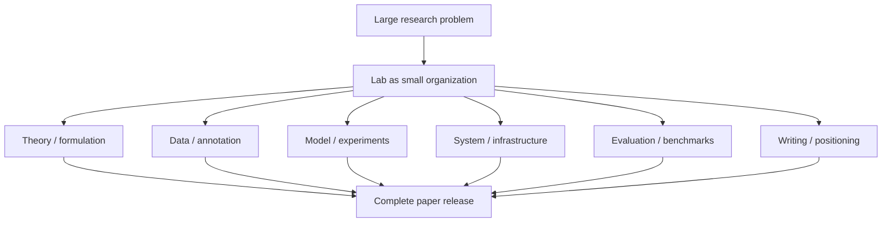
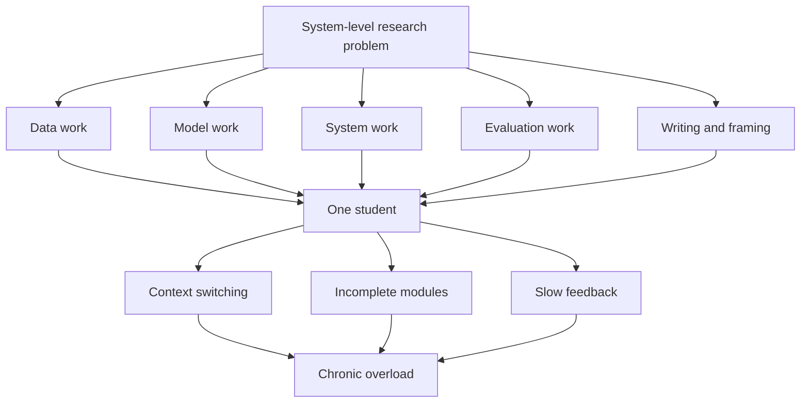
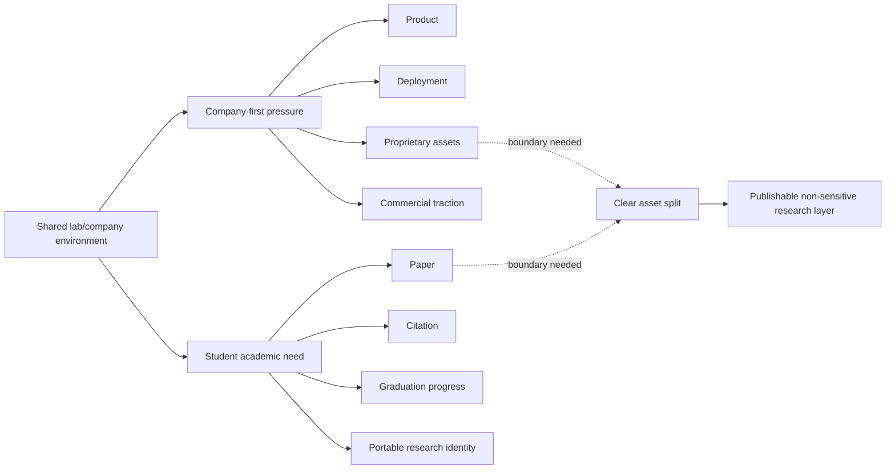
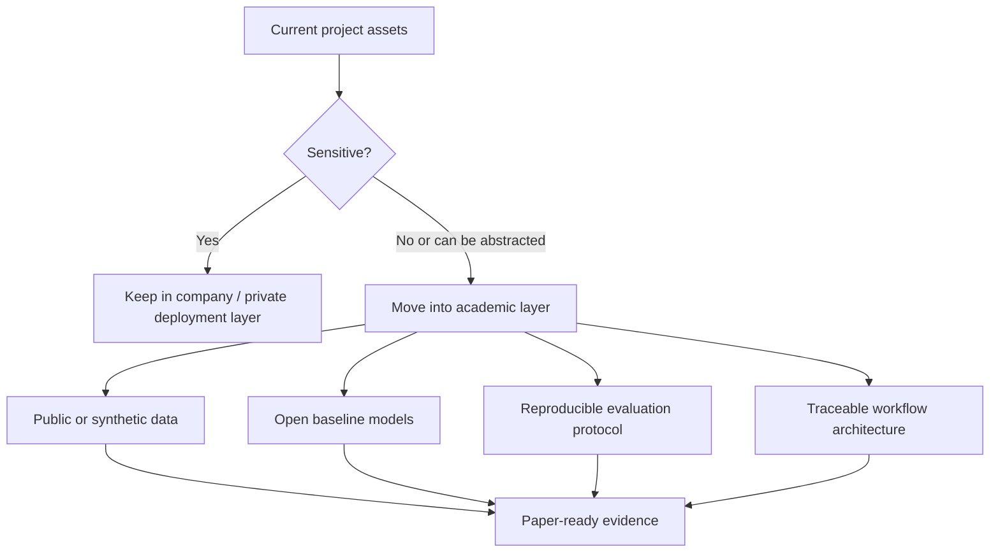
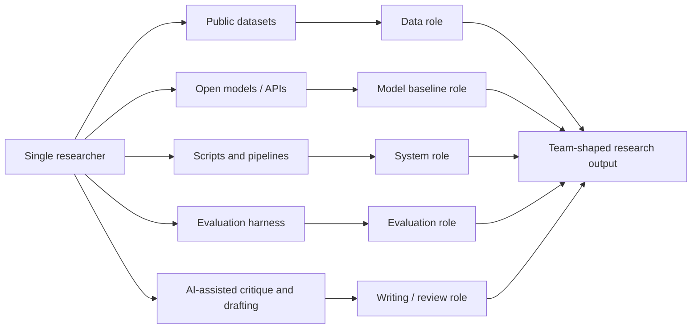
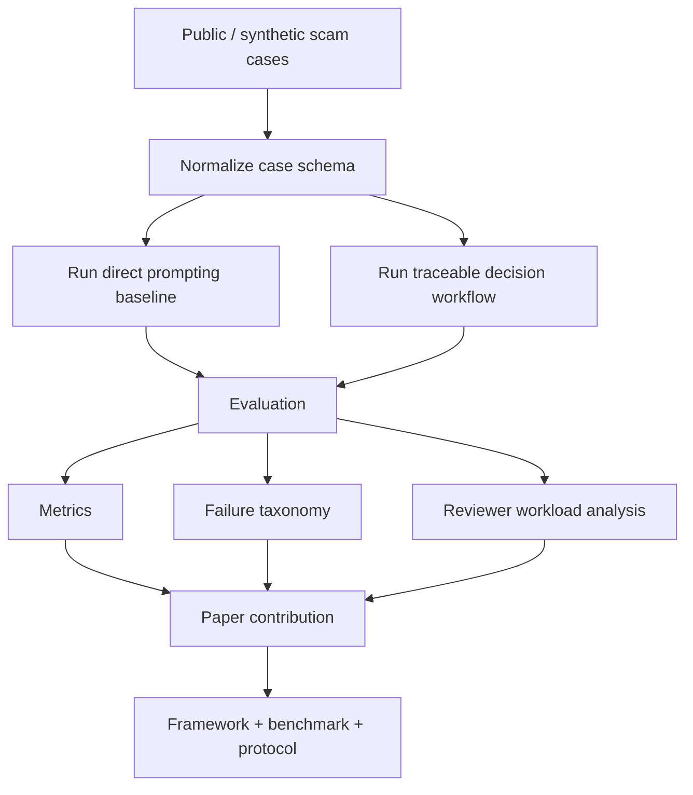
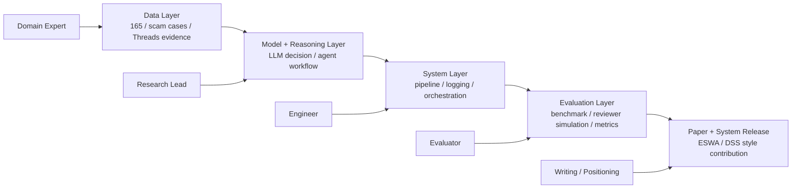

# Taiwan Academic Research Team Scale Structure Incentives

## Core Question

為什麼國外的學術論文常常是很多大學、研究機構、公司一起發，而且看起來很厲害、很完整？為什麼台灣比較少看到這種大規模、多角色、系統級合作？台灣是否都是單打獨鬥？如果是，為什麼？

## One-Line Thesis

台灣不是單打獨鬥，而是研究的規模、結構、誘因跟美國等大型研究生態系不一樣，所以最後呈現出來的論文形態差很多。

## Plain Explanation For Other Readers

This note is about a research-system mismatch.

The question is not simply:

```text
Why am I tired?
```

The deeper question is:

```text
Why does the research task have the size of a team project, while the local environment asks one student to carry it?
```

In large foreign labs, a complex paper often behaves like a product release. Different people own data, models, systems, evaluation, writing, and positioning. In a small or closed lab, those roles may collapse into one person. If the project also connects to a company or proprietary product, the academic path can become even harder because publishable work, private data, product work, and company advantage are not naturally the same thing.

The practical conclusion is:

```text
Do not wait for the lab to become the ideal team.
Design a research path that can survive without that team.
```

The proposed escape route is a `single-person executable, team-shaped` paper structure. Instead of depending on hidden resources or external collaborators, use public data, synthetic cases, open models, scripted pipelines, AI-assisted critique, and clear evaluation rubrics to reproduce the roles that a larger lab would normally provide.

## Mermaid Diagrams

### 1. Why Foreign Papers Often Look Like Team Releases



Plain reading:

- The paper looks complete because multiple roles are covered.
- The author list is often the visible trace of a hidden production system.
- The important unit is not only the individual researcher, but the research organization around the problem.

### 2. Why The Same Kind Of Work Feels Overwhelming In A Small Lab



Plain reading:

- The student is not just doing more tasks.
- The student is switching roles that would normally be split across a team.
- Exhaustion can be a structural signal: the work is assigned to the wrong unit of organization.

### 3. Company-First Constraint Versus Academic Need



Plain reading:

- Company work and academic work can coexist, but only with a clear boundary.
- A product feature is not automatically a paper contribution.
- The student needs a publishable layer that can be evaluated without private company assets.

### 4. Boundary Design For A Publishable Layer



Plain reading:

- The breakthrough is not to fight for every resource.
- The breakthrough is to identify which parts can become public, reproducible, and academically legible.
- Sensitive assets stay out of the paper path.

### 5. Non-Human Shadow Team



Plain reading:

- If direct external people are blocked, the first substitute is not another person.
- The substitute is a research system: public resources, tools, automation, and AI support.
- The human remains the architect and final decision maker.

### 6. Solo-Safe Paper Path



Plain reading:

- The paper does not need privileged 165 data to begin.
- The comparison can be between direct prompting and a traceable workflow.
- The contribution is the framework, benchmark design, evaluation protocol, and reproducible evidence.

## Working Answer

國外頂級論文常常像產業級工程：

```text
一個 lab 約等於一個小型公司
一篇 paper 約等於一個產品 release
作者名單約等於完整專案團隊
```

同一篇論文裡，可能有人負責理論，有人負責實驗，有人負責系統，有人負責資料，有人負責寫作、投稿策略、benchmark 設計與合作協調。當問題本身是 foundation model、大型系統、標準 benchmark、跨機構資料或真實部署時，單人幾乎不可能完成。

所以國外多作者論文不是單純「比較會掛名」，而是很多研究題目本來就被當成大型工程專案在推進。

## Structural Differences

### 1. Resource Scale

國外大型 lab 可能有：

- 幾十位 PhD / postdoc / research scientist
- 專職工程師
- 專職 data annotator 或 data engineer
- 工業界算力、資料、平台與產品場景
- 百萬美元等級的 project budget

台灣常見 lab 可能是：

- 3 到 10 人
- 很少專職工程或資料支援
- 學生同時扛 literature review、coding、experiment、writing、簡報、行政與投稿

同樣一個問題，國外可以用團隊解；台灣常常只能靠個人能力加少數人合作撐住。

### 2. Evaluation Incentives

國外頂尖研究生態系更容易獎勵：

- high-impact work
- large problem framing
- cross-lab collaboration
- long-cycle system building
- industry-scale evaluation

台灣普遍制度更容易強化：

- 論文數量
- 第一作者位置
- 老師與學生的穩定產出壓力
- 能被切小、能按期畢業、能穩定投稿的題目

這會自然導向小題目、個人主導、快速產出，而不是把 5 到 20 人拉在一起做一個大系統。

### 3. Collaboration Culture And Surface Area

國外常見：

- MIT + Stanford + Google / Meta / Microsoft 類型的跨校跨業界合作
- lab 之間互相交換學生、資料、算力、benchmark、平台
- research engineer 與 PhD 共同推進系統

台灣也有合作，但比較常落在：

- 同 lab
- 同校
- advisor 自己的人脈網
- 較淺層的產學合作

結果是國外論文容易長成聯盟型研究，台灣論文比較容易長成單一 lab 輸出。

### 4. Problem Selection

國外頂級論文常處理：

- foundation model
- ultra-large-scale system
- benchmark definition
- infrastructure / deployment / policy coupling
- cross-institution dataset construction

這些題目一開始就需要多人、多角色、多機構。

台灣常見題目比較偏：

- application-oriented research
- existing method improvement
- small-to-medium experiment validation
- narrow benchmark comparison

這些題目一個人或少數人就能完成，也比較符合資源限制與畢業壓力。

## Taiwan Is Not Empty Of Strong Teams

台灣不是沒有強團隊，也不是沒有 multi-author paper 或國際合作。值得注意的節點包括：

- Academia Sinica
- National Taiwan University
- National Yang Ming Chiao Tung University
- TSMC and related industry-academia collaboration

這些地方也會進頂會，也有 NeurIPS / ICML / system / semiconductor / AI-healthcare 等國際合作。但整體比例、資源密度、工程支援與跨機構合作常態，仍然不像美國大型研究網路那麼高。

## Summary Contrast

```text
國外：用團隊規模解決問題。
台灣：用個人能力撐住問題。
```

這不是能力高低的單純比較，而是制度、資源、合作網路、畢業壓力與評價方式共同造成的形態差異。

## Lab Experience Diagnosis

This explains why the current lab experience can feel exhausting:

```text
system-level problem + individual-scale resources = chronic overload
```

The feeling of being unable to keep up is not automatically evidence of personal weakness. It may be evidence that the task has the shape of a team project while the local environment treats it as an individual student project.

In the current research context, the work is not just:

- tune one model
- modify one algorithm
- run one benchmark
- write one narrow paper

It is closer to:

```text
AI + cybersecurity + decision system + real-world workflow + governance + evaluation
```

In a large foreign lab, this would often become a team:

- one person owns model / reasoning
- one person owns data
- one person owns system / infrastructure
- one person owns evaluation
- one person owns writing / positioning
- one person coordinates milestones and external framing

In the current structure, one person is often asked to play all roles at once.

That creates three stacked sources of fatigue.

### 1. The Task Is Too Large But Not Split

When the real task is "make the whole system work," every missing piece becomes the same person's problem:

- data is incomplete
- code is unfinished
- evaluation is unclear
- paper framing is unstable
- domain assumptions need checking
- system evidence needs packaging

The result is a constant feeling of patching holes rather than finishing bounded tasks.

### 2. No Role Separation Means Constant Context Switching

A single day can require:

- writing code
- debugging data
- designing an evaluation protocol
- reframing the paper contribution
- checking security / governance realism
- preparing advisor-facing narrative
- doubting whether the whole direction is valid

The fatigue is not only the amount of work. It is the role switching.

The brain is forced to act as engineer, researcher, analyst, project manager, and writer without stable boundaries.

### 3. Lack Of Shared Completion Creates Isolation

Research needs some sense of:

```text
This is not only mine to carry.
```

When nobody else can take over a module, review a piece deeply, own a deliverable, or push a stuck part forward, the project becomes psychologically isolating. This is a structural problem, not merely an emotional one.

The important interpretation:

```text
Tired does not mean weak.
Tired may mean the work is currently assigned to the wrong unit of organization.
```

## Current Structural Constraint

The immediate problem is not only that the lab is small. The current concern is that the research environment appears to be drifting toward a company-first allocation model while the student need is still academic:

```text
environment priority: company traction / product / proprietary assets
student need: publishable, cumulative, academically legible output
```

These two priorities can coexist, but only if the boundary is designed deliberately. Without explicit boundary design, the company side can absorb time, data, infrastructure, and attention, while the academic side receives too little reusable output.

Observed / perceived constraints to account for:

- few available lab members
- limited internal research manpower
- limited engineering / data support
- reluctance to seek outside help because of concern about research results leaking or being taken
- resources and attention increasingly oriented toward startup needs
- unclear boundary between academic research assets and company assets

The strategic implication:

```text
This environment will probably not naturally become a large research team.
```

So the breakthrough cannot depend on waiting for the lab to suddenly add people, open collaboration, or reallocate resources back toward academic production. The breakthrough has to come from designing an academic path that survives under these constraints.

## Risk Diagnosis

The situation creates three structural risks.

### 1. Resource Reallocation Risk

If time, data, code, meetings, and advisor attention flow mainly toward company needs, the academic work becomes thinner even when the student is working hard.

Symptoms:

- many tasks feel urgent but do not become paper progress
- product work consumes research energy
- implementation improves but contribution framing remains unclear
- data or system access may stay tied to non-public company context

### 2. Over-Control Risk

Concern about being scooped or losing research / commercial advantage can lead to a closed system:

- no external collaborators
- no outside reviewers
- no modular handoff
- no independent feedback loop
- no one to fill missing roles

The protective instinct is understandable, but if overused it slows the research and increases single-person load.

### 3. Goal Misalignment Risk

The student needs:

- paper
- citation
- academic positioning
- graduation progress
- portable research identity

The company side needs:

- product
- deployment
- proprietary advantage
- customer / investor traction
- commercially useful assets

These are not automatically aligned. A product feature is not automatically a paper contribution. A paper contribution is not automatically useful for a company. The bridge has to be designed.

## Strategic Reframe Under Constraint

The job is not:

```text
make the lab become the ideal research environment
```

The job is:

```text
design a survivable academic path inside a constrained, company-leaning environment
```

That means the key skill is boundary design.

The research path needs to separate:

- what is company-sensitive
- what is academically publishable
- what can be reproduced without private data
- what can be evaluated with synthetic / public / abstracted evidence
- what external collaborators can touch safely

## Possible Routes

### Route A: Become An Independent Academic Node

The goal is not necessarily to leave immediately. The goal is to carve out an academic line that is not fully dependent on lab/company resources.

Possible boundary:

| Block | Purpose | Public? | Primary owner |
| --- | --- | --- | --- |
| real sensitive data | company / deployment | no | advisor / company |
| synthetic or public validation data | research validation | yes | student |
| model / reasoning design | research contribution | yes, if abstracted | student |
| evaluation protocol | research contribution | yes | student + external reviewer if possible |
| deployment system | company use | no | company |
| paper framing | academic output | yes | student |

This creates a controllable territory:

```text
publishable method + reproducible evaluation + non-sensitive evidence
```

The point is to avoid being blocked by access to private company data or closed deployment infrastructure.

### Route B: Build A Non-Human Shadow Team

If the advisor does not trust external people, then do not design the first breakthrough around external people.

Use a different substitution:

```text
replace team members with systems, modules, public resources, AI assistants, and repeatable pipelines
```

The missing team roles can be partially covered this way:

| Missing role | Non-human substitute | Practical use |
| --- | --- | --- |
| data collaborator | public datasets, synthetic cases, public scam reports, Hugging Face / Kaggle-style resources | build reproducible validation without private data |
| model collaborator | open-source models, API models, published baselines | compare against known methods instead of inventing everything |
| system collaborator | scripts, workflow automation, reproducible pipelines | reduce manual repeated work |
| evaluation collaborator | benchmark suite, test harness, adversarial / stress cases | make judgment repeatable instead of purely subjective |
| writing collaborator | LLM-assisted outline, reviewer simulation, related-work organizer | speed up framing while the student keeps final judgment |

The goal is not to pretend tools are people. The goal is to remove as many human bottlenecks as possible from the research loop.

This changes the question from:

```text
How do I find people if the lab will not allow external people?
```

to:

```text
How do I make the research not require direct human collaborators at the first stage?
```

### Route B1: Use Public Resources As Shadow Members

Public datasets, open models, and open benchmarks are accumulated work from other researchers. They can function as indirect collaboration without creating a direct trust issue.

Use them as:

- public dataset -> experiment substrate
- open-source model -> baseline
- published method -> comparison target
- public benchmark -> evaluation anchor
- paper artifacts -> reproducibility model

This lets a solo researcher create a team-like research structure:

```text
public data + open baseline + repeatable evaluation + private integration judgment
```

### Route B2: Split Work Into Switchable Modules

The current fatigue comes partly from treating the project as one large block. The solo-safe alternative is to turn each role into a module with clear input and output.

Example module split:

| Module | Input | Output |
| --- | --- | --- |
| data module | public / synthetic scam cases | normalized case schema |
| model module | normalized cases + prompt/workflow | model decision + trace |
| system module | scripts + configs | reproducible run logs |
| evaluation module | outputs + labels/rubrics | metrics + error taxonomy |
| writing module | results + diagrams | paper section draft |

Operational rule:

```text
One work block should touch one module only.
```

This reduces context switching. Instead of being engineer, evaluator, writer, and project manager in the same hour, the project becomes a sequence of module passes.

### Route B3: Use AI As Execution Layer, Not Decision Owner

AI tools can fill execution roles if the human keeps architectural control.

Possible division:

| Role | AI/tool support | Human responsibility |
| --- | --- | --- |
| paper framing | outline drafts, contribution alternatives, reviewer objections | choose the real claim |
| related work | clustering papers, summarizing candidate anchors | verify citations and relevance |
| code | boilerplate, scripts, test scaffolds | inspect behavior and correctness |
| evaluation | adversarial case generation, rubric drafts | approve benchmark validity |
| writing | section drafts, clarity passes | final argument and voice |

The solo researcher becomes:

```text
PM + architect + final decision maker
```

AI becomes:

```text
execution layer + critique layer + drafting layer
```

This is the closest available substitute for a research team when direct human collaboration is blocked.

### Route B4: Build A Re-Runnable Pipeline

The strongest solo substitute for a team is automation.

Target pipeline:

```text
data -> preprocess -> model/workflow -> evaluation -> report
```

Benefits:

- fewer repeated manual steps
- faster experiment iteration
- cleaner evidence for paper writing
- easier comparison across models / prompts / workflows
- stronger reproducibility story
- less dependence on hidden lab/company resources

The pipeline does not have to be perfect. Even a half-automated pipeline can replace many hours of manual coordination.

### Route B5: Make The Research Non-Sensitive By Design

If sensitive resources are politically blocked, design the first paper line so it does not need them.

Constraints:

- no real 165 private data
- no company deployment details
- no proprietary system claims
- no external people needing sensitive access

Use instead:

- synthetic scam cases
- public scam examples
- public social-media style examples
- open-source LLMs / accessible API models
- framework and evaluation contribution

This creates a paper route that can be completed without asking for the most blocked resources.

### Route C: Extract The Publishable Layer From The Product

If the advisor is prioritizing a startup, the usable move is to ask:

```text
Which layer of this system can become a paper without exposing company assets?
```

Likely paper layers:

- decision trace explainability
- AI governance pipeline
- human-review workflow
- evaluation framework
- benchmark / stress-test design
- reproducible synthetic case set
- system architecture pattern
- failure taxonomy

Company layer:

- real customer / agency data
- production deployment
- proprietary workflow integration
- commercial product claims

This flips the relationship:

```text
the company context becomes motivation and realism
the academic layer remains independently publishable
```

## Breakthrough Test

For each current research asset, ask:

1. Can this be reproduced without real sensitive data?
2. Can this become a benchmark / framework / evaluation protocol?
3. Can a module be improved by public resources, AI tools, or automation without exposing company-sensitive material?

If any answer is yes, that asset may be a breakthrough point.

The best near-term target is probably:

```text
paper-ready framework + synthetic/public evaluation + clear boundary from company assets
```

This is the likely exit from the current trap: not waiting for resources, but designing the academic output so it no longer depends on the most constrained resources.

## Solo-Safe Paper Architecture

A realistic paper architecture under the no-external-people constraint:

```text
single-person executable, team-shaped structure
```

Possible title:

```text
Evaluating Traceable LLM Decision Workflows for Scam-Report Assessment Using Synthetic and Public Cases
```

Core design:

| Paper component | Team-like role it replaces | Solo-safe implementation |
| --- | --- | --- |
| benchmark cases | data team | synthetic + public scam examples |
| baseline models | model team | open-source / API model comparisons |
| workflow pipeline | system team | scripted preprocessing, inference, logging |
| evaluation rubric | evaluation team | trace consistency, decision explainability, reviewer workload |
| reviewer simulation | adversarial reviewer / QA team | LLM-assisted critique plus human final screening |
| paper narrative | writing team | structured outline + iterative LLM-assisted drafts |

Main research question:

```text
Can a traceable LLM workflow produce more inspectable and consistent scam-report decisions than direct single-shot prompting?
```

Candidate evaluation dimensions:

- decision consistency
- trace completeness
- evidence-grounding quality
- uncertainty handling
- reviewer workload reduction
- failure taxonomy quality
- robustness against ambiguous or adversarial cases

The paper does not need to claim access to privileged 165 data. The contribution can be:

```text
framework + benchmark design + evaluation protocol + reproducible evidence
```

## Research Strategy Implication

如果自己正在做研究，可以把路線分成兩種。

### Route A: Taiwan-Common Solo-Strong Path

- 小題目
- 快速產出
- 個人主導
- 一人完成大部分流程

優點：

- 穩
- 可控
- 容易對齊畢業與投稿節奏

限制：

- impact ceiling 容易被題目規模限制
- 系統完整性不足
- 很難做出國外那種大型 release 感

### Route B: System-Level Team Path

適合像這類題目：

- AI + 資安 + 165 反詐騙系統
- governance + decision system
- agent workflow + evaluation + deployment control
- AI safety / cyber defense / public-interest infrastructure

這些不是單一 algorithm paper，而是 system-level problem。

升級方式：

- 拉不同角色的人進來
- 分成 data / model / evaluation / system / governance / writing 模組
- 先做完整系統，再讓 paper 成為副產品
- 把研究管理成 release，而不是只管理成一篇論文

可能的 5 到 10 人分工：

| Role | Responsibility |
| --- | --- |
| PI / research lead | problem framing, contribution boundary, publication strategy |
| system architect | pipeline, infra, integration, reproducibility |
| data lead | dataset schema, source control, labeling policy, privacy boundary |
| model / agent lead | model workflow, agent behavior, ablation design |
| evaluation lead | metrics, baselines, stress tests, benchmark protocol |
| domain expert | scam / security / governance / legal realism |
| writing lead | paper narrative, related work, figures, response-to-reviewers |
| product / PM role | milestones, release notes, task splitting, coordination |

## Reframing The Current Research As A Divisible System

The old mode is:

```text
I have to finish this whole system by myself.
```

The stronger mode is:

```text
I have to shape this system so other people can join and complete parts of it.
```

This is the key move from solo survival to research leadership. The work has to be decomposed before a team can form around it.

### Four-Layer Split

| Layer | Scope | Natural owner |
| --- | --- | --- |
| Data layer | 165 / scam cases / Threads evidence, annotation schema, source reliability, privacy boundary | data-oriented collaborator |
| Model / reasoning layer | LLM decision logic, agent workflow, reasoning trace, failure modes | primary research lead |
| System layer | pipeline, orchestration, logging, reproducibility, trace storage | engineering collaborator |
| Evaluation layer | benchmark, reviewer attack simulation, baselines, metrics, stress cases | evaluator / cross-domain collaborator |

Practical meaning:

- The data layer should produce reusable, auditable evidence structures.
- The model layer should define what the system decides and why.
- The system layer should make the process repeatable and inspectable.
- The evaluation layer should prove where the system works, fails, and improves over baselines.

### Mermaid Sketch



The point of this diagram is not to create management overhead. It is to make the hidden work visible enough that other people can help.

## Practical Diagnostic Question

When feeling exhausted, ask:

```text
Was this task actually designed for one person?
```

If the answer is no, the next move is not self-blame. The next move is to change the structure:

- cut scope
- split modules
- define owners
- turn vague expectations into deliverables
- keep the primary research contribution under personal control
- invite help only where the module boundary is clear

This changes the identity of the work:

```text
from one person carrying everything
to one person leading a decomposable system
```

## Personal Observation

很多台灣學生會卡在：

> 我要自己做完，才算厲害。

但國外大型研究常常更看重：

> 我能不能把人組起來，做出更大的東西。

這兩種能力不同。前者是個人研究生存能力，後者是研究組織與系統建構能力。若目標是 system-level work，後者會變得非常重要。

## Possible Next Test

把目前的 `165 + AI + agent` 研究想像成一個 5 到 10 人可協作的研究架構，檢查它是否能被拆成清楚模組：

- data module
- model / agent module
- evaluation module
- system / infra module
- governance / decision module
- writing / publication module

判斷標準：

- 每個模組是否有明確輸入、輸出、owner？
- 單人做會不會變成瓶頸？
- 多人一起做是否會提高品質，而不是只增加溝通成本？
- 是否能對齊 ESWA / DSS 這類 system-level 期刊的期待？
- paper 是否能成為系統工作的副產品，而不是唯一產物？

## Next Concrete Output To Design

Draft a paper-independent / lab-resource-light version of the current research:

```text
working title: AI-Governed Scam Decision Workflow: A Reproducible Framework With Synthetic Evaluation
```

Minimum skeleton:

- problem: scam / 165-style reports need traceable AI-assisted decision support
- contribution 1: decision workflow architecture
- contribution 2: evidence and reasoning trace schema
- contribution 3: synthetic / public benchmark cases
- contribution 4: evaluation protocol for decision quality, traceability, and reviewer workload
- boundary: no private company data, no sensitive deployment details
- optional company link: real-world motivation only, not required for reproducibility

This would preserve academic progress even if the lab remains small, closed, and company-oriented.

## Parking Decision

Keep as an active brainstorm seed.

This note is not yet an execution plan. Its value is to reframe a frustration about Taiwan research culture into a practical research-design question:

```text
How can a Taiwan-based researcher deliberately build system-level collaboration despite local resource and incentive constraints?
```
