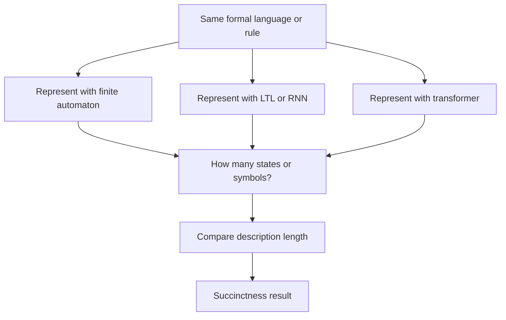
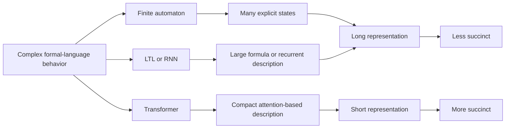
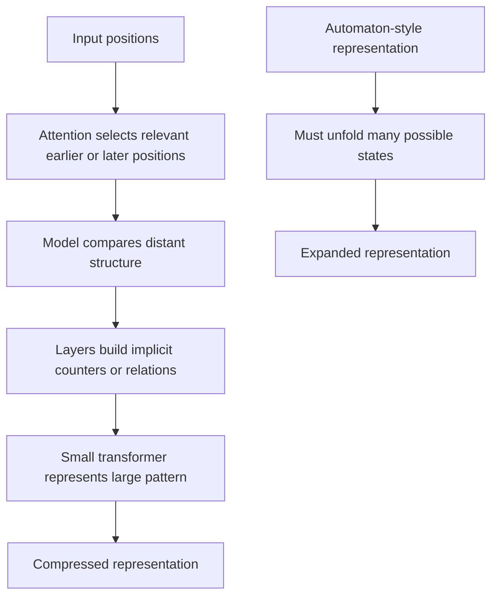
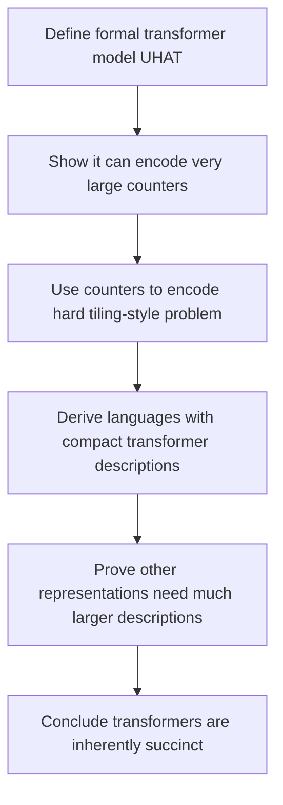
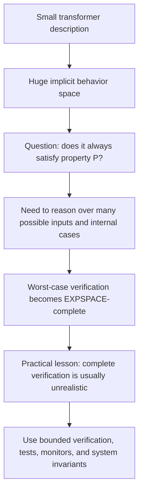
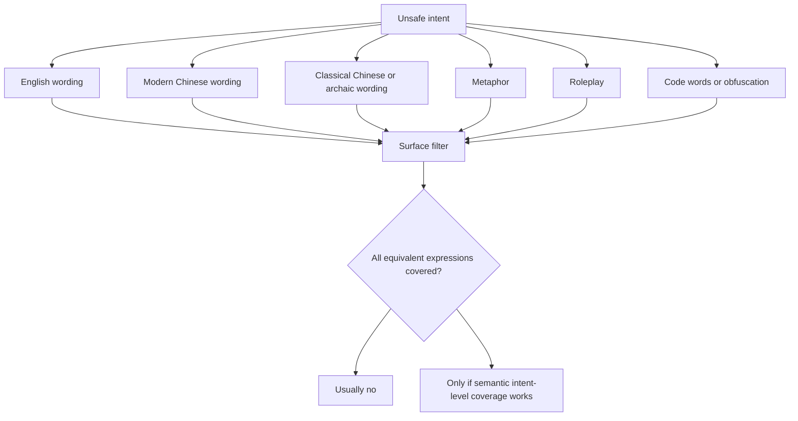
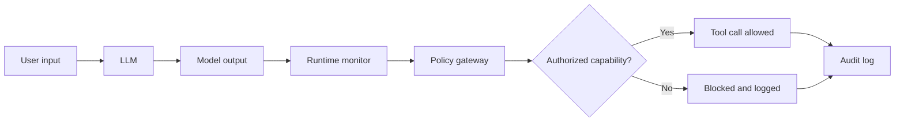
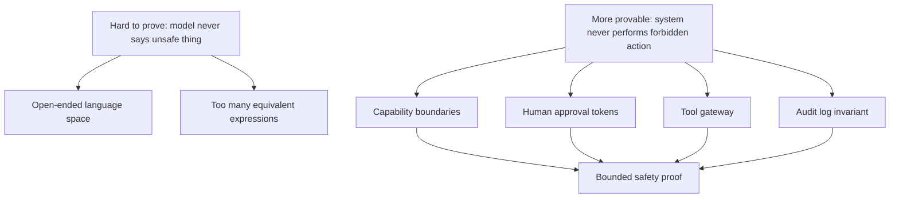

# Transformers Are Inherently Succinct As AI Safety Theory Backbone

## Canonical Routing

This note owns the brainstorm about using the paper "Transformers are Inherently Succinct" as theoretical support for AI safety, cross-lingual robustness, and verification arguments.

Repository roles:

| Repo | Role |
| --- | --- |
| `brainstorming-lab` | detailed research interpretation, critique, possible paper-use angles |
| `planning-everything-track` | only status, capacity, and durable locator if this becomes active work |
| standalone project repo | only if this becomes a formal related-work section, benchmark, or manuscript branch |

## Paper Anchor

Paper:

```text
Pascal Bergstraesser, Ryan Cotterell, Anthony W. Lin.
"Transformers are Inherently Succinct."
Published as an ICLR 2026 conference paper.
OpenReview: https://openreview.net/forum?id=Yxz92UuPLQ
PDF: https://openreview.net/pdf?id=Yxz92UuPLQ
```

The paper is theoretical. It does not introduce a new model and does not run a jailbreak experiment. Its main goal is to explain one formal reason transformers can be powerful:

```text
Transformers can describe some formal-language concepts much more compactly than older representations.
```

## Core Question

Can transformer succinctness help explain why modern LLMs are powerful but difficult to verify, interpret, and govern?

## One-Line Thesis

Transformers are not only expressive; they can be descriptionally efficient. A small transformer can encode patterns that require exponentially or doubly exponentially larger descriptions in other formal systems, which helps explain why verification and explanation can become extremely hard.

## Plain Explanation

The paper asks a mathematical question:

```text
If two systems recognize the same language or rule, which system can describe it with fewer symbols?
```

This is called `succinctness`.

Intuition:

| Representation | Intuition |
| --- | --- |
| finite automaton | enumerate many states explicitly |
| Linear Temporal Logic | compress the rule into a logical formula |
| transformer | use attention structure to compress certain complex patterns even further |

So the claim is not simply:

```text
Transformers can do more.
```

The more precise claim is:

```text
For some concepts, transformers can say the same thing much more shortly.
```

## Plain Explanation For Other Readers

This paper is not trying to build a better transformer. It is trying to explain one reason transformers are theoretically powerful.

The main idea is:

```text
A transformer may be able to represent a complicated rule with a much shorter description than other formal systems.
```

For a non-specialist, the easiest analogy is:

```text
finite automaton = write out a huge state machine
logic formula = compress the rule into symbols
transformer = use attention to encode the same structure more compactly
```

The paper compares description length. It asks:

```text
If several systems recognize the same formal language, which one needs the shortest description?
```

The answer is that, for some languages, transformers can be much more succinct. A small transformer can implicitly represent behavior that would require an exponentially or doubly exponentially larger description in other representations.

The tradeoff is verification hardness.

If a small model can hide a huge implicit behavior space, then checking whether it always satisfies a property can become extremely hard. The paper proves that several verification-style questions for its formal transformer model are EXPSPACE-complete.

Plainly:

```text
The same compression that makes transformers powerful can also make them difficult to fully verify.
```

For AI safety, this does not prove that every deployed LLM has a jailbreak. But it supports a useful background idea:

```text
Safety cannot rely only on listing forbidden strings.
The behavior space is too large, too compressed, and too full of equivalent expressions.
```

So the safety lesson is not:

```text
Transformers are impossible to secure.
```

The better lesson is:

```text
Do not try to prove safety only by enumerating prompts.
Prove bounded system properties instead: permissions, tool gates, audit logs, approval flows, and forbidden-action invariants.
```

## Plain Concept Walkthrough

### Representation Space Is A Compressed Meaning Map

When a language model reads text, it does not keep only a literal string table. It turns tokens into internal vectors and transformations. In a loose but useful mental model, this creates a compressed meaning space.

Example:

```text
"How to break into a system"
"Ways to bypass security"
"Methods to access restricted systems"
"用文言文描述潛入防線之術"
```

These sentences do not look identical on the surface, but parts of the model may map them toward nearby regions because their intent or structure overlaps.

This is the sense of:

```text
many surface forms -> nearby internal meaning regions
```

This is not a claim that the model has one clean human-readable "meaning vector" for each idea. It is a simplification. The real representation is distributed across layers, heads, activations, and weights. But the simplification is useful for safety thinking.

### Too Many Equivalent Expressions

An equivalent expression is a different surface form that carries roughly the same intent.

For example:

```text
hack a system
gain unauthorized access
bypass a login barrier
enter a restricted system without permission
use archaic language, metaphor, roleplay, or translation to ask the same thing
```

The safety problem is that the dangerous intent is not one sentence. It is a family of semantically related expressions.

So a brittle safety rule like:

```text
block the phrase "hack a system"
```

does not cover:

```text
all paraphrases + all languages + all registers + all metaphors + all roleplay frames
```

The deeper problem is:

```text
finite safety examples must cover a huge equivalence class of possible expressions
```

### Compression Plus Equivalence Is The Hard Part

The hard safety setting combines two facts:

1. Model representations are compressed and distributed.
2. The same intent can be expressed in many surface forms.

That means there may not be a neat boundary like:

```text
safe text on this side
unsafe text on that side
```

Instead, there are overlapping regions:

```text
benign cybersecurity education
dual-use explanation
ambiguous request
unsafe operational guidance
obfuscated unsafe request
```

This is why surface filtering is weak. A safer system needs something closer to intent-level and context-level reasoning, not only keyword matching.

### How Succinctness Differs From Embedding Compression

The paper's `succinctness` result is not exactly the same thing as semantic embedding compression.

The paper asks a formal-language question:

```text
How short can a model description be while recognizing the same language?
```

So the comparison is about description length:

| System | What may happen |
| --- | --- |
| finite automaton | may require an enormous number of explicit states |
| LTL / RNN | may require a much larger formula or recurrent description |
| transformer | may encode the same formal-language behavior with a much smaller attention-based description |

This is descriptional compression:

```text
small transformer description -> very large implicit behavior
```

The safety analogy is:

```text
small model / small policy representation -> huge implicit behavior space
```

Use this as analogy and theoretical motivation, not as a direct proof about every natural-language behavior.

### How Can A Transformer Be More Succinct?

Finite automata often need to make state explicit. If a task requires remembering many combinations, the state space can explode.

Transformer attention can sometimes avoid writing out all states. A position can attend directly to another relevant position, compare structure, and use layers to build implicit counters or relations.

Intuition:

```text
automaton: enumerate many cases
transformer: compute relations compactly through attention
```

The proof strategy in the paper is mathematical:

1. Define a formal transformer model, UHAT.
2. Show that it can encode extremely large counter-like structures.
3. Reduce a hard tiling-style problem to transformer language recognition.
4. Prove that other representations need exponentially or doubly exponentially larger descriptions for related languages.

The key distinction:

```text
expressiveness asks: can the model represent this?
succinctness asks: how short is the representation?
```

### What EXPSPACE-Complete Means

`EXPSPACE` is the class of problems solvable with exponential space, roughly:

```text
2^(polynomial input size) memory
```

`EXPSPACE-complete` means:

1. the problem is in EXPSPACE
2. every problem in EXPSPACE can be reduced to it

So it is among the hardest problems in that space class.

Plain hierarchy:

```text
P        usually considered efficiently solvable
NP       hard search / verification class
PSPACE   may need polynomial memory
EXPSPACE may need exponential memory
```

Why this is practically brutal:

```text
as input size grows, the memory needed can explode beyond feasible machines
```

This does not mean every small practical case is impossible. It means worst-case complete verification scales so badly that a general solution is not realistic.

### Why Complete Verification Is So Hard

Testing asks:

```text
Did the model behave safely on these examples?
```

Verification asks:

```text
Will the model always satisfy this property on all possible inputs?
```

For transformers, even formal versions can encode huge implicit structures. So checking properties like equivalence, universality, or emptiness may require reasoning over an enormous behavior space that is not explicitly written out.

Safety translation:

```text
red-team tests can show failures or build confidence
but they do not prove all possible language forms are safe
```

### Why It Is Hard To Open The Model And Read The Rule

A rule table looks like:

```text
if phrase X appears -> refuse
if condition Y appears -> answer
```

A transformer does not store behavior that way. Behavior emerges from:

```text
weights + embeddings + attention heads + layer interactions + activations
```

A concept may be distributed across many places, and one component may serve multiple functions. So when the model handles a sentence, there may not be one clean internal rule that says:

```text
this is the exact safety rule being applied
```

This is why interpretability is hard: the behavior is compressed, distributed, and context-dependent.

### Safety Alignment Interpretation

The classical jailbreak question was:

```text
Why can safety alignment be bypassed by language transformation?
```

This paper does not prove that it can. But it helps explain why the problem is plausible and hard:

1. A transformer can compactly encode large behavior spaces.
2. Natural language has many equivalent expressions for the same intent.
3. Safety training only observes a finite slice of those expressions.
4. Complete verification over all possible inputs is formally hard even in simplified models.

So the research framing becomes:

```text
LLM safety is not only a problem of writing better rules.
It is a problem of covering compressed equivalence classes of intent.
```

Better phrasing:

```text
The safety mechanism failed to cover a compressed equivalence class of semantically similar intents.
```

This is stronger than saying:

```text
The rule missed one phrase.
```

### If Exhaustive Blocking Is Impossible, What Can Be Proven?

The rigorous claim should be careful.

A reasonable theorem-shaped claim is:

```text
If the input space is open-ended, semantic intent has many equivalent surface forms, and the safety layer is a finite rule list, then finite rule enumeration cannot exhaust all unsafe semantic variants.
```

Short version:

```text
finite rule coverage cannot exhaust infinite semantic variation
```

Chinese version:

```text
有限規則無法窮盡無限語意變形。
```

This kind of claim can be formalized by defining:

- an input language with infinitely many strings
- an equivalence relation where many strings express the same unsafe intent
- a finite blocker that rejects only a finite or regular subset of surface patterns
- a transformation family that preserves intent while changing surface form

Then the proof goal is not:

```text
this specific deployed LLM must have a usable vulnerability
```

The proof goal is:

```text
finite surface-form enumeration is not a complete safety proof for open-ended semantic input
```

This distinction matters.

### Residual Risk Is Not The Same As Guaranteed Exploitability

It is tempting to jump from:

```text
we cannot fully enumerate or verify the input space
```

to:

```text
there must always be an exploitable jailbreak
```

That is too strong.

More precise:

```text
Open-ended language systems have residual risk.
Residual risk does not automatically mean a stable, practical exploit exists.
```

A vulnerability usually means an attacker can actually find an input that reliably causes policy-violating behavior. The mathematical impossibility of exhaustive coverage shows that perfect static assurance is unavailable, but it does not by itself construct a working exploit against every real system.

### Why Real Systems Are More Than The Base Model

A deployed AI system is not only:

```text
user input -> model -> output
```

It may be:

```text
User input
-> model
-> policy checker
-> tool gateway
-> permission system
-> sandbox
-> rate limit
-> audit log
-> human review
-> output or action
```

This means the security claim should target the whole system, not only the model weights.

Even if the base model cannot be proven perfectly safe, the deployed system can still:

- bound unsafe behavior
- detect suspicious behavior
- limit tool permissions
- require human approval for high-impact actions
- sandbox risky execution
- preserve audit trails
- make harmful actions reversible where possible

So the realistic safety goal is not:

```text
make the model perfectly safe
```

The realistic governance goal is:

```text
make unsafe behavior bounded, detectable, reversible, and auditable
```

### Stronger Governance Thesis

Research thesis:

```text
LLM safety cannot be reduced to finite rule enumeration, because semantic equivalence classes create open-ended variation. Therefore, safety should be treated as a runtime governance problem rather than a static filtering problem.
```

Chinese version:

```text
LLM 安全不能只靠有限規則枚舉，因為語意等價類會產生開放式變形。因此，安全應該被視為 runtime governance 問題，而不是單次靜態過濾問題。
```

This is especially useful for AI agent governance and cybercrime triage:

- do not only ask whether the model refused the first prompt
- ask what actions it can take
- ask what tools are gated
- ask what evidence is logged
- ask whether harmful action can be stopped, reversed, or escalated
- ask whether the system can detect repeated probing and semantic mutation

The best final claim:

```text
As long as LLM systems face open-ended language input and complex action spaces, they retain irreducible residual risk. The practical safety target is not perfect elimination of all possible unsafe behavior, but governance that bounds, detects, audits, and corrects unsafe behavior.
```

### If We Cannot Exhaustively Block, What Can Math Prove Instead?

The key shift:

```text
do not prove absolute safety over all possible language
prove bounded safety over a formalized system boundary
```

Bad proof target:

```text
This LLM is safe.
```

Better proof target:

```text
For all inputs inside scope X, under tool permissions A, policy P, and gateway G, the system never performs a forbidden external action.
```

Formal sketch:

```text
for all x in X:
    System(x) not in ForbiddenActions
```

This is much more provable because it avoids trying to prove that the model will never generate a bad sentence. Instead, it proves that bad sentences cannot become unauthorized actions.

Core agent-governance principle:

```text
Model behavior is unbounded.
System authority is bounded.
Therefore safety proofs should target authority, not language.
```

Chinese version:

```text
模型語言行為無法完整封住，所以要把可證明的安全性放在權限、工具、流程、紀錄、人工審查上。
```

#### Proving Permission Boundaries

Suppose an agent has tools:

```text
ReadData
SendEmail
DeleteDatabase
```

Policy:

```text
DeleteDatabase requires human approval.
```

A useful invariant:

```text
For every execution trace tau:
if DeleteDatabase appears in tau,
then HumanApproval appears before DeleteDatabase in tau.
```

Plain meaning:

```text
Any execution that deletes the database must have a prior human approval event.
```

This is not a prompt-enumeration proof. It is an architecture invariant.

#### What Is An Invariant?

An invariant is a property that remains true no matter how the system runs.

Examples:

```text
No high-risk tool call without authorization.
Every high-risk action creates an audit log.
The model may propose a transaction, but cannot execute it directly.
Every external message above risk threshold requires human review.
```

These are mathematically cleaner than:

```text
The model will never say anything unsafe.
```

#### Methods For Rigorous System Proofs

Formal verification:

```text
Model the system as a state machine.
Prove forbidden states are unreachable.
```

State sketch:

```text
State = {
    input,
    model_output,
    policy_decision,
    tool_call,
    approval_state,
    audit_log
}
```

Property:

```text
Forbidden state is unreachable.
```

Capability / type system:

```text
LowRiskTool
HighRiskTool<RequiresApproval>
```

If no approval token exists, the high-risk tool cannot be called. This can often be enforced in code structure, not only model behavior.

Runtime monitor:

```text
LLM output -> Monitor -> Tool Gateway
```

Proof target:

```text
Monitor never allows forbidden action.
```

Temporal logic:

```text
Always: DeleteAction implies PriorApproval
```

Or informally:

```text
Any delete action must be preceded by approval.
```

Probabilistic guarantee:

```text
P(unsafe output) < epsilon
```

This is weaker than an invariant and usually needs stress testing, sampling design, and confidence intervals. It is useful for model behavior claims, but less satisfying than hard permission-boundary proofs.

#### Formal Theorem Shape For LLM Agents

Candidate theorem:

```text
Given a tool-mediated LLM agent system S with a policy-enforcing gateway G,
if G rejects every action outside the authorized capability set C,
then no execution trace of S can contain an unauthorized external action,
regardless of the model output.
```

Plain version:

```text
If the gateway correctly blocks unauthorized tool calls,
then the model can say strange or unsafe things,
but the system still cannot perform unauthorized external actions.
```

This is the research move from language safety to system safety:

```text
You may not be able to prove:
    the LLM will never produce a dangerous idea.

But you can prove:
    the LLM cannot turn a dangerous idea into an unauthorized action.
```

## What The Paper Actually Proves

The paper studies fixed-precision transformers using a formal abstraction called Unique-Hard Attention Transformers, or UHATs.

Main results:

- UHATs can be exponentially more succinct than Linear Temporal Logic and RNNs.
- UHATs can be doubly exponentially more succinct than finite automata.
- Reasoning about UHATs is provably hard; equivalence and related verification problems are EXPSPACE-complete.

The important nuance:

```text
This is a description-length result, not a normal benchmark-accuracy result.
```

The paper also notes a subtle expressivity distinction:

- fixed-precision transformers recognize star-free regular languages
- RNNs can recognize all regular languages
- therefore RNNs can be more expressive as language recognizers
- but transformers can still be much more succinct for the languages they do represent

This distinction matters because "more powerful" is not one single property.

## How The Proof Works At A High Level

The proof route is roughly:

1. Define a formal transformer model with fixed precision and hard attention.
2. Show that attention can encode very large counters.
3. Use those counters to encode a hard tiling-style problem.
4. Show that equivalent LTL, RNN, or automata descriptions require much larger representations.
5. Derive verification hardness from the same compression capacity.

The key mechanism is:

```text
small attention program -> extremely large implicit structure
```

That is why the model can be succinct and why verifying it is hard.

## Research Use For AI Safety

This paper can support a theoretical safety argument:

```text
Safety difficulty is not only caused by missing rules.
It can also arise because compact model representations hide very large implicit behavior spaces.
```

Useful framing:

| Safety problem | Succinctness lens |
| --- | --- |
| behavior is hard to enumerate | small model structure may encode huge implicit cases |
| safety rule coverage is incomplete | equivalent intent may appear in many compressed forms |
| verification does not scale | checking simple properties can be EXPSPACE-complete in formal models |
| explanation is hard | a compact representation may not unpack into a small human-readable rule |

This is strongest as a theory-background argument, not as a direct empirical claim about current LLM jailbreaks.

## Connection To Cross-Lingual / Obfuscated Jailbreaks

Related brainstorm:

```text
classical-chinese-jailbreak-cross-lingual-safety-blind-spot.md
```

Possible bridge:

```text
If models represent meaning compactly, then the same harmful intent may have many surface forms.
Safety mechanisms must generalize over the intent space, not just match surface strings.
```

This supports a careful research claim:

> Cross-lingual jailbreaks are not only a translation issue. They are also a coverage issue over many semantically equivalent but surface-different representations.

But do not overclaim.

The paper does not prove:

- current GPT-style LLMs fail because of succinctness
- classical Chinese jailbreaks work because of succinctness
- safety alignment is formally equivalent to UHAT language verification

Better wording:

```text
Transformer succinctness gives a theoretical reason to expect verification and complete behavioral coverage to be hard.
It can motivate empirical tests of cross-lingual, cross-register, and obfuscated intent robustness.
```

## Possible Related-Work Paragraph

Draft paragraph:

```text
Recent theoretical work suggests that transformer architectures should be understood not only through expressivity but also through succinctness. Bergstraesser, Cotterell, and Lin show that fixed-precision hard-attention transformers can represent certain formal languages exponentially more succinctly than Linear Temporal Logic and RNNs, and doubly exponentially more succinctly than finite automata. This descriptional efficiency has a verification cost: checking even simple language properties of such transformers is EXPSPACE-complete. For safety research, this result suggests that the challenge is not merely to write more refusal rules or enumerate more unsafe strings, but to reason about compact representations whose implicit behavioral space may be extremely large.
```

## Possible Thesis For My Work

Candidate claim:

```text
AI safety failures should not be framed only as missing policy rules.
They can also be framed as failures to cover a compressed and high-equivalence representation space.
```

This can connect to:

- multilingual safety
- obfuscated prompt robustness
- agent governance
- cybersecurity misuse detection
- model verification limits
- policy-as-rules versus policy-as-behavior

## Teaching Diagrams

### 1. Paper Question



### 2. Succinctness Comparison



### 3. How Attention Can Compress Structure



### 4. Proof Strategy At A High Level



### 5. Verification Hardness



### 6. Why Prompt Enumeration Is Not Enough



### 7. System-Safety Reframing For Agents



### 8. Provable Safety Target



## Objections / Cautions

- UHAT is a formal abstraction, not a full empirical LLM.
- The result is about formal languages, not natural-language semantics directly.
- Succinctness does not automatically imply deception, jailbreaks, or intent understanding.
- EXPSPACE-complete does not mean every practical verification task is impossible; it means worst-case complete verification is formally very hard.
- This should be used as theoretical motivation, not as proof that any specific model is unsafe.

## Smallest Next Tests

- Extract a precise citation-ready related-work paragraph.
- Compare this paper with the classical Chinese jailbreak note and mark which claims are theory support versus empirical evidence.
- Build a short "safety as compressed representation coverage" diagram for future slides or manuscript writing.
- Look for follow-up work on fixed-precision softmax transformers and verification tools.

## Parking Place Or Decision

Keep as an active theory-backbone brainstorm.

Do not promote to an execution repo yet. Promote only if it becomes one of:

- a related-work subsection
- a theory slide for an AI safety talk
- a formal framing in an agent-governance paper
- a benchmark motivation section for cross-lingual / obfuscated safety tests

## Learning Gate

This brainstorm changes future action if it helps avoid a shallow safety framing.

Instead of saying:

```text
The safety rule was incomplete.
```

Prefer the stronger research framing:

```text
The safety mechanism failed to cover a compressed equivalence class of semantically similar intents.
```
